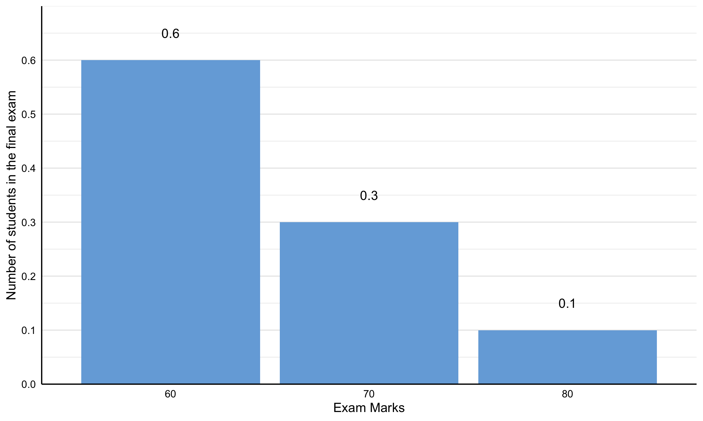

# Generalised Least Squares 

<p style = "margin-bottom: 0px; font-size: 20px; ">**Slope Estimation**</p>

- **Description**
- **Mathematics**
- **Mathematics (Matrix)**
  - $\hat{\mathbf{\beta}} = (\mathbf{X'V^{-1}X})^{-1}\mathbf{X'V^{-1}Y}$
    ***Where***
      - $(\mathbf{X'V^{-1}X})^{-1}$ - The sampling error variance-covariance 
      
```{r library}
library(tidyverse)
```

```{r}
expectation_dat <- 
  data.frame(
    x = c(0, 1, 2, 3, 4, 5, 6, 7, 8, 9, 10),
    y = c(3, 5, 10, 15, 20, 25, 10, 5, 3, 3, 1)
    ) |> 
  mutate(
    y_prop = y/sum(y),
    x_y_prop = x*y_prop)


expectation_plot_1 <- 
  ggplot() +
  geom_bar(
    data = expectation_dat, 
    mapping = aes(
      x = x,
      y = y
    ),
    stat = "identity",
    fill = "#76ABDC"
  ) +
  geom_text(
    data = expectation_dat, 
    mapping = aes(
      x = x, 
      y = y+1,
      label = y
    ),
    colour = "white"
  ) +
  scale_x_continuous(limits = c(-0.5,10.5), breaks = seq(0, 10, 1)) +
  scale_y_continuous(
    expand = c(0,0), 
    limits = c(0, 27),
    breaks = seq(0,25, 5)) +
  theme_minimal() +
  theme(
    axis.line.x = element_line(size = 0.5, colour= "white"),
    axis.line.y = element_line(size = 0.5, colour = "white"),
    panel.grid.major.x = element_line(size = 0),
    panel.grid.minor.x = element_line(size = 0),
    axis.title.x=element_text(colour="white"),
    axis.title.y=element_text(colour="white"),
    axis.text.x = element_text(colour = "white"),
    axis.text.y = element_text(colour = "white")) +
  labs(
    x = "Number of cases of theft at Sainsbury's per day",
    y = "Number of times in 100 days",
    fill = "white"
  )


expectation_plot_1
ggsave(filename = "expectation_plot_1.png", expectation_plot_1, width = 2500, scale = 1, units = "px")

expectation_plot_2 <- 
  ggplot() +
  geom_bar(
    data = expectation_dat, 
    mapping = aes(
      x = x,
      y = y_prop
    ),
    stat = "identity",
    fill = "#76ABDC"
  ) +
  geom_text(
    data = expectation_dat, 
    mapping = aes(
      x = x, 
      y = y_prop+0.01,
      label = y_prop
    ),
    colour = "white"
  ) +
  scale_x_continuous(limits = c(-0.5,10.5), breaks = seq(0, 10, 1)) +
  scale_y_continuous(
    expand = c(0,0), 
    limits = c(0, 0.27),
    breaks = seq(0,0.25, 0.05)) +
  theme_minimal() +
  theme(
    axis.line.x = element_line(size = 0.5, colour= "white"),
    axis.line.y = element_line(size = 0.5, colour = "white"),
    panel.grid.major.x = element_line(size = 0),
    panel.grid.minor.x = element_line(size = 0),
    axis.title.x=element_text(colour="white"),
    axis.title.y=element_text(colour="white"),
    axis.text.x = element_text(colour = "white"),
    axis.text.y = element_text(colour = "white")) +
  labs(
    x = "Number of cases of theft at Sainsbury's per day",
    y = "Proportion of times in 100 days",
    fill = "white"
  )

ggsave(filename = "expectation_plot_2.png", expectation_plot_2, width = 2500, scale = 1, units = "px")


expectation_dat_2 <- 
  data.frame(
    x = c(60, 70, 80),
    y = c(6, 3, 1)
    ) |> 
  mutate(y_prop = y/sum(y))


expectation_student_marks_plot_1 <- 
  ggplot() +
  geom_bar(
    data = expectation_dat_2, 
    mapping = aes(
      x = x,
      y = y
    ),
    stat = "identity",
    fill = "#76ABDC"
  ) +
  geom_text(
    data = expectation_dat_2, 
    mapping = aes(
      x = x, 
      y = y+2,
      label = y
    ),
    colour = "white"
  ) +
  scale_x_continuous(limits = c(55,85), breaks = seq(50, 80, 10)) +
  scale_y_continuous(
    expand = c(0,0), 
    limits = c(0, 7),
    breaks = seq(0,6, 1)) +
  theme_minimal() +
  theme(
    axis.line.x = element_line(size = 0.5, colour= "black"),
    axis.line.y = element_line(size = 0.5, colour = "black"),
    panel.grid.major.x = element_line(size = 0),
    panel.grid.minor.x = element_line(size = 0),
    axis.title.x=element_text(colour="black"),
    axis.title.y=element_text(colour="black"),
    axis.text.x = element_text(colour = "black"),
    axis.text.y = element_text(colour = "black")) +
  labs(
    x = "Exam Marks",
    y = "Number of students in the final exam",
    fill = "black"
  )
ggsave(filename = "expectation_student_marks_plot_1.png", expectation_student_marks_plot_1, width = 2500, scale = 1, units = "px")


expectation_student_marks_plot_2 <- 
  ggplot() +
  geom_bar(
    data = expectation_dat_2, 
    mapping = aes(
      x = x,
      y = y_prop
    ),
    stat = "identity",
    fill = "#76ABDC"
  ) +
  geom_text(
    data = expectation_dat_2, 
    mapping = aes(
      x = x, 
      y = y_prop +0.05,
      label = y_prop
    ),
    colour = "black"
  ) +
  scale_x_continuous(limits = c(55,85), breaks = seq(50, 80, 10)) +
  scale_y_continuous(
    expand = c(0,0), 
    limits = c(0, .7),
    breaks = seq(0,.6, .10)) +
  theme_minimal() +
  theme(
    axis.line.x = element_line(size = 0.5, colour= "black"),
    axis.line.y = element_line(size = 0.5, colour = "black"),
    panel.grid.major.x = element_line(size = 0),
    panel.grid.minor.x = element_line(size = 0),
    axis.title.x=element_text(colour="black"),
    axis.title.y=element_text(colour="black"),
    axis.text.x = element_text(colour = "black"),
    axis.text.y = element_text(colour = "black")) +
  labs(
    x = "Exam Marks",
    y = "Number of students in the final exam",
    fill = "black"
  )
expectation_student_marks_plot_2
ggsave(filename = "expectation_student_marks_plot_2.png", expectation_student_marks_plot_2, width = 2500, scale = 1, units = "px")
```

      
<p style = "margin-bottom: 0px; font-size: 20px; ">**Expectation**</p>
  - **Expectation of a random variable**
    - **Concept**
      - weighted by its probability or proportion of occurrence/proportion relative to the entire population or density of 1
      - The expectation is the area under the function in which the value of the random variable is weighted by its probability (or proportion of occurrence relative to the entire population of density of 1) (the area of the function $f(x) = xp(x)$)
      - The function produces a distribution with weighted value against the value of the random variable. The distribution is made up of many individual columns with each for each of the possible values of the random variable. The heights of the columns represent the weighted values of their corresponding values of the random variable and all columns have a width of 1. This means that the area of each column simply represents the weighted value of a particular value of the random variable. The also means that the sum of the area of all the columns, which is the area of the distribution, is the weighed average or weighted sum of that random variable, which is the expectation of the random variable. Hence, the expectation of a random variable is found through the area of the function $f(x) = xp(x)$
- **Expectation of a discrete random variable**
  - **Concept**
    - In the discrete case, the function produces a discrete distribution with weighted value against the discrete random variable, which is like a histogram as opposed to a continuous curve like a pdf. The expectation is found through summation where the areas of all the columns are summed. Hence, it really is just the sum of the function  $f(x) = x_ip(x_i)$ for all possible values of the discrete random variable and can be viewed as the weighted average or weighted sum. (when viewed as the weighted average, it is the sum of all possible values of the discrete random variable weighted by its number of occurrence and have the entire sum divided by the sum of all the weighteds; when viewed as the weighted sum, it is the sum of each possible value of the discrete random varible weighted by its probability or proportion of occurrence relative to the entire population or density of 1)
  - **Mathematics**
    - $\displaystyle \text{E}(X) = \sum_{i  = 1}^{k}{x_i p(x_i)}$
      - ***Where***
        - $x$ - A discrete random variable (e.g. the number of the success event in a binomial distribution)
        - $x_i$ - A discrete random variable at a particular discrete value $i$ 
        - $p(x_i)$ - The proportion of the discrete random variable at a particular value $i$
  - <details><summary>**Examples**</summary>
    - **Example 1**
      - **Scenario**
        - Let $X$ be a discrete random variable, specifically, the number of cases of theft at a Sainsbury's store per day 
        - Histogram
          - 
      - **Turn the frequency to proportions**
        - 
      - **The expected value**
        - $\begin{aligned}\displaystyle \text{E}(X) &= \sum_{i  = 1}^{k}{x_i p(x_i)}\\ &=  0(\frac{3}{100}) + 1(\frac{5}{100}) + 3(\frac{10}{100})+ 3(\frac{15}{100}) +  4(\frac{20}{100}) + 5(\frac{25}{100}) + \\ &~~~~~5(\frac{10}{100}) + 7(\frac{5}{100})  + 8(\frac{3}{100}) + 9(\frac{3}{100}) + 10(\frac{1}{100}) \\ &= 0(.03) + 1(.05) + 3(.10)+ 3(.15) +  4(.20) + 5(.25) + \\ &~~~~~5(.10) + 7(.05)  + 8(.03) + 9(.03) + 10(.01) \\ &= 4.31 \end{aligned}$
    - **Example 2**
      - **Scenario**
        - There are 3 possible categories of marks for a final exam, 60, 70, and 80. Out of the cohort of 100 students, 60 achieved a mark of 60, 30 achieved 70, and 10 achieved 80. 
        - 
      - **Turn the frequency to proportions**
        - 
        - **The expectation**
        - $\begin{aligned} \displaystyle \text{E}(M) &= \sum_{i = 1}^{K}{x_i p(x_i)} \\ &= 60\left(\frac{6}{10}\right) + 70\left(\frac{3}{10}\right) + 80\left(\frac{1}{10}\right) \\  &= 60(.60) + 70(.30) + 80(.10) \\ &= 65\end{aligned}$
          - ***Notes***
            - **It is the mean version for the discrete case**
              - This is same as the mean in the discrete case where the expectation is expressed as a weighted average weighted on the proportion of each of the values instead of the sum of each of the observation over the total
            - **Mathematics**
              - $\begin{aligned} \displaystyle \text{E}(M) &= \frac{1}{N}\sum_{i = 1}^{n}{x_i} \\ &= \frac{1}{10}\left[ 60 + 60 + 60 + 60 + 60 + 60 + 70 + 70 + 70 + 80  \right] \\ &= \frac{1}{10} \left[ 60(6) + 70 (3) + 80(1)\right] \\ &= 60\left(\frac{6}{10}\right) + 70\left(\frac{3}{10}\right) + 80\left(\frac{1}{10}\right)\end{aligned}$
              - Which is just 
              - $ \displaystyle x_1p(x_1) + x_2p(x_2) + x_3p(x_3) = \sum_{i = 1}^{K}{x_i p(x_i)} $ </details>

- **Expectation of a continuous random variable**
  - **Concept**
    - It is the centre of mass of the density
    - The weighted sum of a continuous variable - The sum of each possible value of the continuous random variable weighted by its probability or proportion of occurrence/proportion in the entire density or population of 1 (which can be based on its pdf)
    - It is the area under the curve of the graph with probability of occurrence against each possible value of x
    - Since this is a continuous case, integration is used to take into account all possible values. In some cases, the expectation can be converted into its summation form
  - **Mathematics**
    - $\displaystyle \text{E}(X) = \int_{-\infty}^{\infty}{xf(x)} ~ dx$
      - ***Where***
        - $X$ is a continuous random variable with pdf $f(x)$
        
- **Expectation of functions of random variables**
  - **Expectation of functions of discrete random variables**
    - **Mathematics**
      - $\text{E}(g(X)) = \sum_{x}^{}{g(x)p(x)}$
    - **Proof**
  - **Expectation of functions of continuous random variables**
    - **Mathematics**
      - $\displaystyle \text{E}(g(X)) = \int_{-\infty}^{\infty}{g(x)p(x)} ~ dx$
    
    
      

      
      
      
      
      
      
      
      
