# Mathematics


```{r quintic, include = F, echo = F}
library(dplyr)
library(ggplot2)

png(file = "image/quintic.png", res = 100, width = 800, height = 500)
ggplot(data = as.tibble(data.frame(x = seq(-10, 10, by = 0.01))) %>% dplyr::mutate(y = x^(5) - 5*x^(4) + 5*x^(3) + 5*x^(2) -6*x)) + geom_line(mapping = aes(x = x, y = y)) +
  scale_y_continuous(limits = c(-5, 5)) +
  scale_x_continuous(limits = c(-2, 4)) +
  theme_void()

dev.off()

quintic_dat <- as.tibble(data.frame(x = seq(-10, 10, by = 0.001))) %>% dplyr::mutate(y = x^(5) - 5*x^(4) + 5*x^(3) + 5*x^(2) -6*x + 2)

quintic_dat_cut <- quintic_dat %>% dplyr::filter(y > -6 & y < 8) %>% mutate(abs.y = abs(y))


quintic_loc_max_x <- dplyr::filter(dplyr::filter(quintic_dat, x < 0), y == max(y))[1] %>% as.numeric()
quintic_loc_max_x

quintic_loc_max_y <- dplyr::filter(dplyr::filter(quintic_dat, x < 0), y == max(y))[2] %>% as.numeric()
quintic_loc_max_y

quintic_loc_min_x <- dplyr::filter(dplyr::filter(quintic_dat, 2 < x & x < 3), y == min(y))[1] %>% as.numeric()
quintic_loc_min_x

quintic_loc_min_y <- as.numeric(dplyr::filter(dplyr::filter(quintic_dat, 2 < x & x < 3), y == min(y)))[2]
quintic_loc_min_y

#Global Max
quintic_glob_max_x <- dplyr::filter(dplyr::filter(quintic_dat, 2 < x & x < 3), y == min(y))[1] %>% as.numeric()
quintic_loc_min_x

quintic_glob_max_y <- dplyr::filter(dplyr::filter(quintic_dat, 2 < x & x < 3), y == min(y))[2] %>% as.numeric()
quintic_loc_min_y


as.numeric(filter(quintic_dat_cut, y == min(abs(y))[1]))
filter(quintic_dat_cut, abs.y == min(abs.y))
-5.993886

polyroot(c(10, 30, -60, 20))

quintic_parts.p1
as.numeric(polyroot(c(2, -6, 5, 5, -5, 1))[4])

(as.numeric(polyroot(c(10, 30, -60, 20))[3]) - as.numeric(polyroot(c(10, 30, -60, 20))[1]))/2
(as.numeric(polyroot(c(2, -6, 5, 5, -5, 1))[5]) - as.numeric(polyroot(c(2, -6, 5, 5, -5, 1))[3]))/3

as.numeric(polyroot(c(10, 30, -60, 20))[3])^5 - (5*as.numeric(polyroot(c(10, 30, -60, 20))[3])^4)+(5*as.numeric(polyroot(c(10, 30, -60, 20))[3])^3) + (5*as.numeric(polyroot(c(10, 30, -60, 20))[3])^2) - (6*as.numeric(polyroot(c(10, 30, -60, 20))[3])) +2


quintic_parts.p1 <- ggplot(data = quintic_dat_cut) + geom_line(mapping = aes(x = x, y = y)) +
  scale_y_continuous(limits = c(-8, 10), breaks = seq(-8, 10, 1), expand=c(0,0)) +
  scale_x_continuous(limits = c(-3, 5), breaks = seq(-3, 5, 1), expand=c(0,0)) +
  theme_linedraw() +
  annotate(geom = "point", x = quintic_loc_max_x, y = quintic_loc_max_y, shape = 20, fill = "transparent", colour = "#D60000", size = 2.8, stroke = 0.8) +
  annotate(geom = "text", x = quintic_loc_max_x, y = quintic_loc_max_y + 0.75, label = paste("Local Maxima"), size = 3, colour = "#D60000") +
  annotate(geom = "point", x = quintic_loc_min_x, y = quintic_loc_min_y, shape = 20, fill = "transparent", colour = "#D60000", size = 2.8, stroke = 0.8) +
  annotate(geom = "text", x = quintic_loc_min_x, y = quintic_loc_min_y - 0.75, label = paste("Local Minima"), size = 3, colour = "#D60000") +
  annotate(geom = "segment", x = -3, y = 0, xend = 5, yend = 0, colour = "black", size = 0.3) +
  annotate(geom = "segment", x = 0, y = -8, xend = 0, yend = 10, colour = "black", size = 0.3) +
  annotate(geom = "point", x = 0, y = 2, shape = 20, fill = "transparent", colour = "#757575", size = 2.8, stroke = 0.8) +
  annotate(geom = "text", x = 0.38, y = 2, label = paste("Intercept"), size = 3) + 
  annotate(geom = "point", x = as.numeric(polyroot(c(2, -6, 5, 5, -5, 1))[3]), y = 0, shape = 20, fill = "transparent", colour = "#0D8A00", size = 2.8, stroke = 0.8) +
  annotate(geom = "point", x = as.numeric(polyroot(c(2, -6, 5, 5, -5, 1))[4]), y = 0, shape = 20, fill = "transparent", colour = "#0D8A00", size = 2.8, stroke = 0.8) +
  annotate(geom = "point", x = as.numeric(polyroot(c(2, -6, 5, 5, -5, 1))[5]), y = 0, shape = 20, fill = "transparent", colour = "#0D8A00", size = 2.8, stroke = 0.8) +
  annotate(geom = "segment", xend = as.numeric(polyroot(c(2, -6, 5, 5, -5, 1))[3]), yend = 0, x = (as.numeric(polyroot(c(2, -6, 5, 5, -5, 1))[5]) + as.numeric(polyroot(c(2, -6, 5, 5, -5, 1))[3]))/2, y = -3, size = 0.25, colour = "#0D8A00") +
  annotate(geom = "segment", xend = as.numeric(polyroot(c(2, -6, 5, 5, -5, 1))[4]), yend = 0, x = (as.numeric(polyroot(c(2, -6, 5, 5, -5, 1))[5]) + as.numeric(polyroot(c(2, -6, 5, 5, -5, 1))[3]))/2, y = -3, size = 0.25, colour = "#0D8A00") +
  annotate(geom = "segment", xend = as.numeric(polyroot(c(2, -6, 5, 5, -5, 1))[5]), yend = 0, x = (as.numeric(polyroot(c(2, -6, 5, 5, -5, 1))[5]) + as.numeric(polyroot(c(2, -6, 5, 5, -5, 1))[3]))/2, y = -3, size = 0.25, colour = "#0D8A00") +
  annotate(geom = "text", x = (as.numeric(polyroot(c(2, -6, 5, 5, -5, 1))[5]) + as.numeric(polyroot(c(2, -6, 5, 5, -5, 1))[3]))/2, y = -3.5, label = paste("Roots"), size = 3, colour = "#0D8A00") +
  
  annotate(geom = "point", x = as.numeric(polyroot(c(10, 30, -60, 20))[1]), y = 3.530931, shape = 20, fill = "transparent", colour = "#0023B3", size = 2.8, stroke = 0.8) +
  annotate(geom = "text", x = (as.numeric(polyroot(c(10, 30, -60, 20))[3]) - as.numeric(polyroot(c(10, 30, -60, 20))[1]))/2, y = 5.5, label = paste("Points of Inflection"), size = 3, colour = "#0023B3") + 
  annotate(geom = "point", x = as.numeric(polyroot(c(10, 30, -60, 20))[2]), y = 2, shape = 20, fill = "transparent", colour = "#0023B3", size = 2.8, stroke = 0.8) +
  annotate(geom = "point", x = as.numeric(polyroot(c(10, 30, -60, 20))[3]), y = 0.4690689, shape = 20, fill = "transparent", colour = "#0023B3", size = 2.8, stroke = 0.8) +
  annotate(geom = "segment", xend = as.numeric(polyroot(c(10, 30, -60, 20))[1]), yend = 3.530931, x = (as.numeric(polyroot(c(10, 30, -60, 20))[3]) - as.numeric(polyroot(c(10, 30, -60, 20))[1]))/2, y = 5, size = 0.25, colour = "#0023B3") +
  annotate(geom = "segment", xend = as.numeric(polyroot(c(10, 30, -60, 20))[2]), yend = 2, x = (as.numeric(polyroot(c(10, 30, -60, 20))[3]) - as.numeric(polyroot(c(10, 30, -60, 20))[1]))/2, y = 5, size = 0.25, colour = "#0023B3") +
  annotate(geom = "segment", xend = as.numeric(polyroot(c(10, 30, -60, 20))[3]), yend = 0.4690689, x = (as.numeric(polyroot(c(10, 30, -60, 20))[3]) - as.numeric(polyroot(c(10, 30, -60, 20))[1]))/2, y = 5, size = 0.25, colour = "#0023B3")
  

png(file = "image/quintic_parts.png", res = 100, width = 800, height = 500)
quintic_parts.p1 +
  annotate(geom = "point", x = -1.218, y = min(as.data.frame(ggplot_build(quintic_parts.p1)$data[1])$y), shape = 20, fill = "transparent", colour = "#D60000", size = 2.8, stroke = 0.8) +
  annotate(geom = "text", x = -1.218, y = min(as.data.frame(ggplot_build(quintic_parts.p1)$data[1])$y) - 0.75, label = paste("Global Minima"), size = 3, colour = "#D60000") + 
  annotate(geom = "point", x = as.numeric(filter(quintic_dat_cut, y == max(y))[1]), y = max(as.data.frame(ggplot_build(quintic_parts.p1)$data[1])$y), shape = 20, fill = "transparent", colour = "#D60000", size = 2.8, stroke = 0.8) +
  annotate(geom = "text", x = as.numeric(filter(quintic_dat_cut, y == max(y))[1])	, y = max(as.data.frame(ggplot_build(quintic_parts.p1)$data[1])$y) + 0.75, label = paste("Global Maxima"), size = 3, colour = "#D60000") 

dev.off()
```  

<p style = "margin-bottom: 0px; font-size: 20px; ">**Mapping**</p>

- **Concept**
  - Mapping is the process of pairing elements from the input set with elements from the output set based on certain criteria 
- **Types of mapping**
  - **One-to-One** 
    - One element from the input set is mapped onto one element from the output set 
    - One input has one output
    - One value of x has one value of y
  - **Many-to-One** 
    - Multiple elements from the input set is mapped onto one element from the output set 
    - Multiple inputs have one output
    - Multiple values of x have one value of y
  - **One-to-Many**
    - The element from the input set is mapped onto multiple elements of the output set 
    - One input has multiple outputs
    - The value of x has multiple values of y
  - **Many-to-Many** 
    - Multiple elements of the input set is mapped onto multiple elements of the output set 
    - Multiple inputs have multiple outputs
    - Multiple values of x have multiple values of y
- **Testing the type of mapping of a mathematical relational expression**
  - **Testing for one-to-many**
    - The vertical line test
      - Place a vertical line on the graph of the mathematical expression and see if they intersect with each other more than once
      - If they intersect with each other more than once, then the mathematical expression has a one-to-many mapping
  - **Testing for many-to-one**
    - **The horizontal line test**
      - Place a horizontal line on the graph of the mathematical expression and see if they intersect with each other more than once
      - If they intersect with each other more once, then the mathematical expression has a many-to-one mapping 
  - **Testing for many-to-many**
    - **The horizontal and vertical line test**
      - Basically using both the horizontal and vertical line tests 


<p style = "margin-bottom: 0px; font-size: 20px; ">**Functions**</p>

- **Concept**
  - A mathematical relational expression that has a one-to-one or many-to-one mapping (that maps one or more values of a set of inputs to a single output)
  - Mathematical relational expressions that have a one-to-many or many-to-many are not functions
- **Components of a function**
  - **Variables**
    - **Concept**
      - Aka indeterminates
      - **Variable** - Anything that can vary in quantity 
      - A function consists of variables of which the output is a function (in other words, a function consists of variables that varies with the outcome variable)
  - **Coefficient**
    - **Concept**
      - **Coefficients** - Constants that act as multipliers for the variables
    - **The intercept**
      - **Concept**
        - The intercept is the coefficient for the variable with an exponent of 0
      - **What the intercept tells us??**
        - **In general sense**
          - The intercept defines the change on the y-axis from the x-axis in addition to the terms with variables in the function. In terms of graphical transformation, the intercept defines how the graph of the function is shifted on the y-axis from the x-axis 
        - **In terms of the intercept**
          - The intercept defines the y value when x = 0 (or the value of $f(0)$). In terms of graphical transformation, the intercept defines the value of y in the coordinate of the graph that touches the y-axis
- **Related concepts**
  - Domain of a function
  - Range of a function
  - Root(s) of a function
  - Inverse of a function
  - Extrema of a function
- **Domain of a function** 
  - The set of possible inputs for a function or the the set of possible values for the variables in the function
- **Range of a function** 
  - The set of possible outputs of a function
- **Root of a function** 
  - The values of x for which the output is 0 ($f(x) = 0$)
  - Graphically, it is the x-coordinate of the point(s) of the graph of the function that intersect(s) with the x-axis 
- **Intercept of a function**
  - The values of y for which the input is 0 ($f(0)$)
  - Graphically, it is the y-coordinate of the point of the graph of the function that intersects with the y-axis
- **Inverse of a function** - A function that is a reversal of another function (it reverses the subject)
- **Extrema of a function** 
  - **Concept**
    - The most extreme value of the output of a function (plural is extrema)
  - **Types of Extremum**
    - **Maximum vs Minimum**
      - **Maximum** 
        - The highest possible value of the output of a function 
      - **Minimum** 
        - The smallest possible value of the output of a function
    - **Global vs Local**
      - **Local extrema** 
        - The extrema of the function within a certain range of the domain (the variables)
      - **Global extrema** 
        - The extrema of the function on the entire domain of the function 
- **Visualsation**
  - 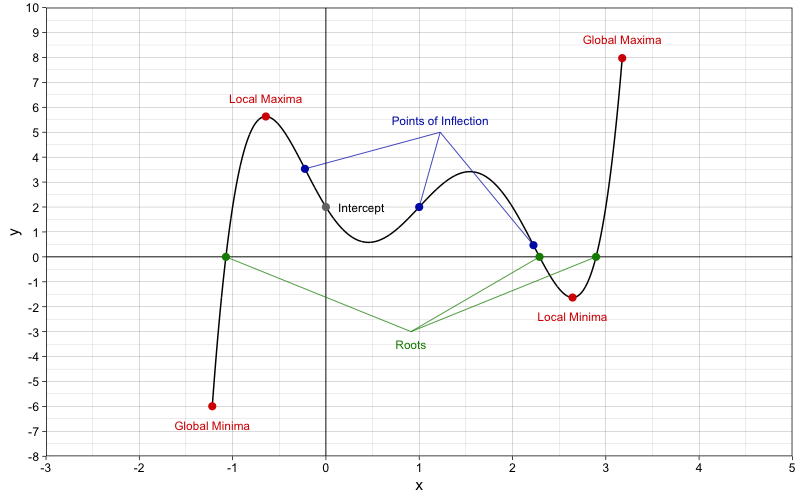{width=50%}
    
 
- <details><summary>**Some Useful Functions**</summary>
  - **General**
    - Exponential
    - Log
    - Sigmoid 
    - Reciprocal
  - **Polynomial Functions**
    - Linear
    - Quadratic
    - Cubic
    - Quartic
    - Quintic
  - **Trigonometric Functions**
    - **Ordinary Trigonometric Functions**
      - Sine
      - Cosine
      - Tangent
    - **Hyperbolic Functions**
      - Hyperbolic Sine
      - Hyperbolic Cosine
      - Hyperbolic Tangent 
  - **Probability/Distributional Functions (Probability and Cumulative)**
    - **Probability Density Function**
      - Normal Distribution
      - Chi-squared Distribution
      - Log-Normal Distribution
      - Exponential Distribution
      - F Distribution
    - **Probability Mass Function**
      - Binomial Distribution
      - Poisson Distribution
      - Bernoulli Distribution
      - Rademacher Distribution </details>
      


<p style = "margin-bottom: 0px; font-size: 20px; ">**Polynomial Functions**</p>

- **Concept**
  - **Polynomial functions** - Functions that are made up of the sum of one or more algebraic terms each of which is the product of a coefficient and one or more variables each of which has a non-negative integer exponent 
  - **The Leading Coefficient** - The coefficient of the variable term with the highest degree or the largest exponent in a polynomial function - The leading coefficient in a polynomial function must not be 0
  - **Degree of a polynomial**
    - The highest possible degree of the polynomial's monomial (individual terms) with non-zero coefficients (the degree of a term is the exponent of the variable)
- **Types of Polynomial Function**
  - **Polynomials by degree**
    - A constant (degree of 0)
    - Linear (degree of 1)
    - Quadratic (degree of 2)
    - Cubic (degree of 3)
    - Quartic (degree of 4)
    - Quintic (degree of 5)
    - and so on... 


<p style = "margin-bottom: 0px; font-size: 20px; ">**The Linear Function**</p>
- **The Linear Function**
  - **Concept**
    - The linear function describes the output as a linear function of one variable (variable x)
    - Aka a polynomial with a degree of 1 
  - **Mathematics**
    - $f(x) = ax + b$
- **The Linear Equation**
  - **Concept**
    - The univariate univariable linear equation is an equation that describes a variable (variable y) as a linear function of another variable (variable x)
  - **Mathematics**
    - $y = ax + b$
      - ***Where***
        - $y$ 
          - Variable y (A variable represented on the y-axis)
          - This variable is usually the output or the variable of interest, which is also called the outcome variable or the dependent variable (DV) in mathematical modelling
        - $x$ 
          - Variable x (A variable represented on the x-axis) 
          - This variable is usually the input, which is also called the predictor variable or the independent variable (IV) in mathematical modelling
        - $a$ 
          - The coefficient for $x$ 
          - It is the weight of the x variable on the y variable 
          - It defines the magnitude of the linear relationship x has on y 
          - Graphically, it defines the slope of the line 
        - $b$
          - The intercept  

```{r quadratic, include = F, echo = F}
library(dplyr)
library(ggplot2)


png(file = "image/quadratic.png", res = 100, width = 800, height = 500)
ggplot(data = as.tibble(data.frame(x = seq(-10, 10, by = 0.01))) %>% dplyr::mutate(y = (x^2)) ) + geom_line(mapping = aes(x = x, y = y)) + scale_y_continuous(limits = c(0, 110)) + scale_x_continuous(limits = c(-15, 15)) + theme_void()
dev.off()

```
          

<p style = "margin-bottom: 0px; font-size: 20px; ">**The Quadratic Function**</p>  
  - **The Quadratic Function**
    - **Concept**
      - The univariable quadratic function describes the output as a quadratic function of one variable
      - A function with a non-zero coefficient for any variables with an exponent of 2
      - In the factored form, it is the product of 2 linear factors 
  - **Mathematics**
    - $f(x) = ax^{2} + bx + c$
- **The Quadratic Equation**
  - **Concept**
    - The univariate univariable quadratic describes a variable (variable y) as a quadratic function of one variable (variable x)
  - **Mathematics**
    - $y = ax^{2} + bx + c$
      - ***Where***   
        - $a$ 
          - Coefficient for $x^{2}$
          - It is the weight of variable x on variable y
          - It defines the magnitude of the quadratic relationship x has on y
          - Graphically, it defines the slope of the quadratic curve
        - $b$ 
          - Coefficient for $x$
        - $c$ 
          - Intercept 
- **The Quadratic Graph**
  - 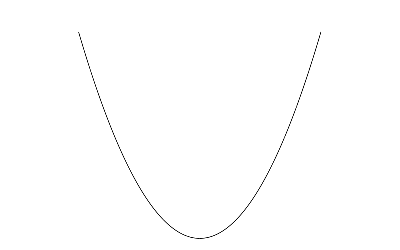{width=30%}
- **Real life examples**
  - Distance Travelled ($s = ut + \frac{1}{2}at^{2}$)
  - Yerkes and Dodson Law (performance is a negative quadratic function of arousal)
  - Bridges 
    - <details><summary>Sydney Barbour Bridge (Negative quadratic)</summary>{width=35%}</details>
    - <details><summary>Clifton Suspension Bridge (Positive quadratic)</summary> {width=35%}</details>
      
      
```{r cubic, include = F, echo = F}
library(dplyr)
library(ggplot2)

png(file = "image/cubic.png", res = 100, width = 800, height = 500)
ggplot(data = as.tibble(data.frame(x = seq(-8, 6, by = 0.01))) %>% dplyr::mutate(y = (x^(3) + 5*(x^(2)) + x))) + geom_line(mapping = aes(x = x, y = y)) +
  scale_y_continuous(limits = c(-70, 70)) +
  scale_x_continuous(limits = c(-15, 15)) +
  theme_void()


png(file = "image/cubic.2.png", res = 100, width = 800, height = 500)
ggplot(data = as.tibble(data.frame(x = seq(-2.5, 2.5, by = 0.01))) %>% dplyr::mutate(y = (x^(3)))) + 
  geom_line(mapping = aes(x = x, y = y)) +
  scale_x_continuous(limits = c(-5,5), breaks = seq(-5, 5, 1)) +
  scale_y_continuous(breaks = seq(-20, 20, 5)) + theme_void()
  
dev.off()

```
  
<p style = "margin-bottom: 0px; font-size: 20px; ">**The Cubic Function**</p>  

- **The Cubic Function**
  - **Concept**
    - The univariable cubic function describes the output as a cubic function of one variable (variable x)
    - The cubic function has a non-zero coefficient for any variables with an exponent of 3
    - In the factored form, it is the product of 3 linear factors or the product of a linear factor and a quadratic factor 
- **Mathematics**
  - $f(x)= ax^{3} + bx^{2} + cx + d$
- **The Cubic Equation**
  - **Concept**
    - The univariate univariable cubic equation describes a variable (variable y) as a cubic function of one variable (variable x)
  - **Mathematics**
    - $y = ax^{3} + bx^{2} + cx + d$
      - ***Where***
        - $a$ - Coefficient for $x^{3}$
        - $b$ - Coefficient for $x^{2}$
        - $c$ - Coefficient for $x$
        - $d$ - Intercept
- **The Cubic Curve**
  - 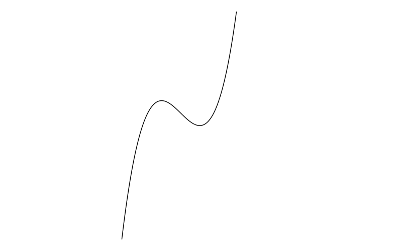{width=30%}
  - 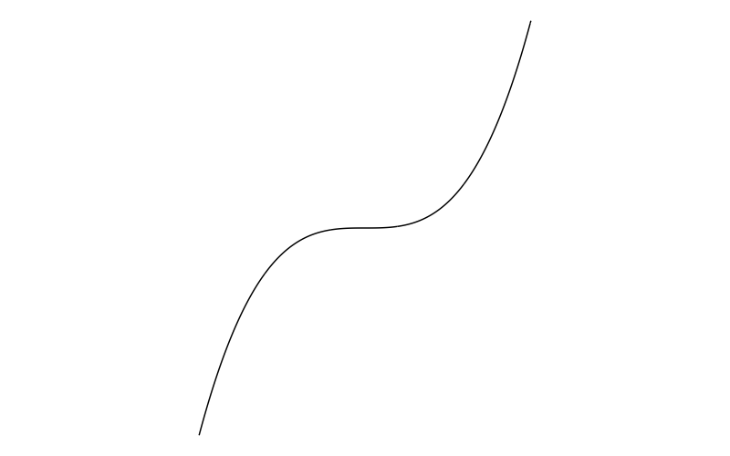{width=30%}


```{r quartic, include = F, echo = F}
library(dplyr)
library(ggplot2)

png(file = "image/quartic.png", res = 100, width = 800, height = 500)
ggplot(data = as.tibble(data.frame(x = seq(-10, 10, by = 0.01))) %>% dplyr::mutate(y = (0.6*x+1.8)*(x+1)*(x-1)*(x-5))) + geom_line(mapping = aes(x = x, y = y)) +
  scale_y_continuous(limits = c(-70, 70)) +
  scale_x_continuous(limits = c(-10, 10)) +
  theme_void()
dev.off()

```
  
  
 <p style = "margin-bottom: 0px; font-size: 20px; ">**The Quartic Function**</p>  
 
 - **The Quartic Function**
  - **Concept**
    - The univariable univariate quartic function describes the output as a quartic function of one variable (variable x)
    - The leading coefficient must be non-zero, in quartic functions, it means that the coefficient for any variables with an exponent of 4 must be non-zero
    - In the factored form, it can be the product of 
      - 4 linear factors
      - 2 quadratic factors
      - 1 linear factor and 1 cubic factor 
  - **Mathematics**
    - $f(x)= ax^{4} + bx^{3} + cx^{2} + dx + e$
- **The Quartic Equation** 
  - **Concept**
    - The univariate univariable quartic equation describes a variable (variable y) as a quartic function of one variable (variable x)
    - ***Where*** 
      - $a$ - Coefficient of $x^4$ 
      - $b$ - Coefficient of $x^3$ 
      - $c$ - Coefficient of $x^2$ 
      - $d$ - Coefficient of $x$
      - $e$ - Intercept
- **The Quartic graph**
  - 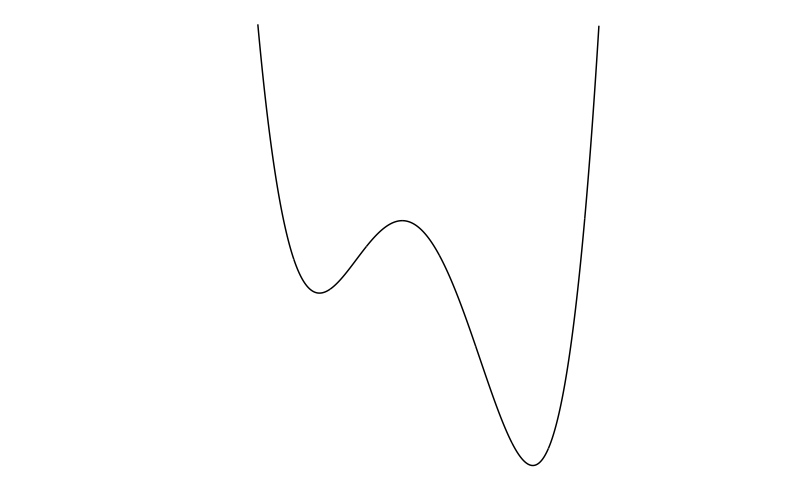{width=30%}
  

  
  
<p style = "margin-bottom: 0px; font-size: 20px; ">**The Quintic Function**</p>  

- **The Quintic Function**
 - **Concept**
  - The univariable univariate quintic function describes the output as a quintic function of one variable (variable x)
  - The leading coefficient must be non-zero, in quintic functions, this means that the coefficient for any variables with an exponent of 5 must be non-zero
  - In the factored form, it can be the product of 
    - 5 linear factors
    - 3 linear factors and 1 quadratic factor
    - 2 linear factors and 1 cubic factor 
    - 1 linear factor and 2 quadratic factors
    - 1 linear factor and 1 quartic factors 
    - 1 quadratic factor and 1 cubic factor 
 - **Mathematics**  
  - $f(x) = ax^{5} + bx^{4} + cx^{3} + dx^{2} + ex + f$
- **The Quintic Equation**
  - **Concept**
    - The univariate univariable quintic equation describes a variable (variable y) as a quintic function of one variable (variable x)
  - **Mathematics**
  - $y = ax^{5} + bx^{4} + cx^{3} + dx^{2} + ex + f$
    - ***Where*** 
      - $a$ - Coefficient of $x^5$
      - $b$ - Coefficient of $x^4$
      - $c$ - Coefficient of $x^3$
      - $d$ - Coefficient of $x^2$
      - $e$ - Coefficient of $x$
      - $f$ - Intercept
- **The Quintic Graph**
  - {width=30%}
  
  
<p style = "margin-bottom: 0px; font-size: 20px; ">**Finding the Intercept of the function**</p>
  
<p style = "margin-bottom: 0px; font-size: 20px; ">**Finding the Root(s) of a function**</p>

<p style = "margin-bottom: 0px; font-size: 20px; ">**Finding the slope of the tangent line of a point of a function**</p>

- **Methods**
  - Drawing a triangle 
  - Differentiation


<p style = "margin-bottom: 0px; font-size: 20px; ">**Finding the Extremum of a function**</p>


<p style = "margin-bottom: 0px; font-size: 20px; ">**Transforming functions**</p>
  

```{r}
library(ggplot2)
library(ggarchery)

png(file = "image/vectors_triangle_law.png", res = 100, width = 800, height = 500)
ggplot2::ggplot() + lims(x = c(0,20), y = c(0,20)) + 
  scale_y_continuous(expand = c(0, 0), limits = c(0, 15), breaks = seq(0, 20, 1)) + 
  scale_x_continuous(expand = c(0, 0), limits = c(0, 15), breaks = seq(0, 20, 1)) +
  annotate("segment", x = 0, xend = 20, y = 0, yend = 0) +
  annotate("segment", x = 0, xend = 0, y = 0, yend = 20) +
  geom_arrowsegment(aes(x = 2, xend = 10, y = 5, yend = 12), 
                    arrow_positions = 0.55, 
                    arrows = arrow(type = 'closed', length = unit(0.1, "inches"))) +
  geom_arrowsegment(aes(x = 10, xend = 12, y = 12, yend = 8), 
                    arrow_positions = 0.55, 
                    arrows = arrow(type = 'closed', length = unit(0.1, "inches"))) +
    geom_arrowsegment(aes(x = 2, xend = 12, y = 5, yend = 8), 
                    arrow_positions = 0.55, 
                    arrows = arrow(type = 'closed', length = unit(0.1, "inches")), arrow_fills = "red", colour = "red") +
  annotate(geom = "text", x = 1.5, y = 4.5, label = paste("A")) +
  annotate(geom = "text", x = 10, y = 13, label = paste("B")) +
  annotate(geom = "text", x = 12.5, y = 7.5, label = paste("C")) +
  annotate(geom = "text", x = 6, y = 9.5, label = expression(~bold("a"))) +
  annotate(geom = "text", x = 11.5, y = 10.5, label = expression(~bold("b"))) +
  annotate(geom = "text", x = 7.25, y = 5.75, label = expression(~bold("r")), colour = "red") +
  annotate(geom = "text", x = 9, y = 4, label = expression(~bold(a)~"+"~bold(b)~"="~bold(r))) +
  theme_linedraw()
dev.off()

#Components of a vector 
png(file = "image/vector_components.png", res = 100, width = 800, height = 500)
ggplot2::ggplot()  +
  scale_x_continuous(limits = c(0, 20), breaks = seq(0, 20, 1), expand = c(0, 0)) +
  scale_y_continuous(limits = c(0, 8), breaks = seq(0, 10, 1), expand = c(0, 0)) +
  geom_arrowsegment(aes(x = 5, y = 3, xend = 15, yend = 6), arrow_positions = 0.55, arrows = arrow(type = "closed", length = unit(0.1, "inches"))) +
  geom_arrowsegment(aes(x = 5, y = 3, xend = 15, yend = 3), arrow_positions = 0.55, arrows = arrow(type = "closed", length = unit(0.1, "inches"))) +
  geom_arrowsegment(aes(x = 5, y = 3, xend = 5, yend = 6), arrow_positions = 0.55, arrows = arrow(type = "closed", length = unit(0.1, "inches"))) +
  annotate(geom = "text", x = 10.25, y = 5, label = expression(~bold(a))) +
  annotate(geom = "text", x = 4.5, y = 4.5, label = expression(~bold(c[y]))) +
  annotate(geom = "text", x = 10.25, y = 2.65, label = expression(~bold(c[x]))) +
  annotate(geom = "text", x = 10.25, y = 2.65 -0.5, label = expression("vector"~bold(c[x])~"is the x component of vector"~bold(a)), size = 4) +
  annotate(geom = "text", x = 5, y = 6.25, label = expression("vector"~bold(c[y])~"is the y component of vector"~bold(a)), size = 4, angle = 0) +
  theme_linedraw()

dev.off()

#Polygon law
png(file = "image/vectors_polygon_law.png", res = 100, width = 800, height = 500)
ggplot2::ggplot()  +
  scale_x_continuous(limits = c(0, 20), breaks = seq(0, 20, 1), expand = c(0, 0)) +
  scale_y_continuous(limits = c(0, 10), breaks = seq(0, 10, 1), expand = c(0, 0)) +
  geom_arrowsegment(aes(x = 3, y = 3, xend = 6, yend = 9), arrow_positions = 0.55, arrows = arrow(type = "closed", length = unit(0.1, "inches"))) +
    geom_arrowsegment(aes(x = 6, y = 9, xend = 12, yend = 8), arrow_positions = 0.55, arrows = arrow(type = "closed", length = unit(0.1, "inches"))) +
    geom_arrowsegment(aes(x = 12, y = 8, xend = 15, yend = 4), arrow_positions = 0.55, arrows = arrow(type = "closed", length = unit(0.1, "inches"))) +
    geom_arrowsegment(aes(x = 3, y = 3, xend = 15, yend = 4), arrow_positions = 0.55, arrows = arrow(type = "closed", length = unit(0.1, "inches")), arrow_fills = "red", colour = "red") +
  annotate(geom = "text", x = 4, y = 6.25, label = expression(~bold(a))) + 
  annotate(geom = "text", x = 9.25, y = 9, label = expression(~bold(b))) +
  annotate(geom = "text", x = 14, y = 6, label = expression(~bold(c))) +
  annotate(geom = "text", x = 9.5, y = 3, label = expression(~bold(r))) +
  annotate(geom = "text", x = 2.5, y = 2.5, label = paste("A")) +
  annotate(geom = "text", x = 6, y = 9.5, label = paste("B")) +
  annotate(geom = "text", x = 12.5, y = 8.5, label = paste("C")) +
  annotate(geom = "text", x = 2.5, y = 2.5, label = paste("A")) +
  annotate(geom = "text", x = 15.5, y = 3.5, label = paste("D")) + 
  annotate(geom = "text", x = 12, y = 2, label = expression(~bold(a)~"+"~bold(b)~"+"~bold(c)~"="~bold(r))) +
  theme_linedraw()
dev.off()  


png(file = "image/vectors_polygon_law.2.png", res = 100, width = 800, height = 500)
ggplot2::ggplot()  +
  scale_x_continuous(limits = c(0, 20), breaks = seq(0, 20, 1), expand = c(0, 0)) +
  scale_y_continuous(limits = c(0, 10), breaks = seq(0, 10, 1), expand = c(0, 0)) +
  geom_arrowsegment(aes(x = 3, y = 3, xend = 6, yend = 9), arrow_positions = 0.55, arrows = arrow(type = "closed", length = unit(0.1, "inches")), arrow_fills = "#999999",  colour = "#999999") +
    geom_arrowsegment(aes(x = 6, y = 9, xend = 12, yend = 8), arrow_positions = 0.55, arrows = arrow(type = "closed", length = unit(0.1, "inches")),  arrow_fills = "#999999",  colour = "#999999") +
    geom_arrowsegment(aes(x = 12, y = 8, xend = 15, yend = 4), arrow_positions = 0.55, arrows = arrow(type = "closed", length = unit(0.1, "inches"))) +
    geom_arrowsegment(aes(x = 3, y = 3, xend = 15, yend = 4), arrow_positions = 0.55, arrows = arrow(type = "closed", length = unit(0.1, "inches")), arrow_fills = "black", colour = "black") +
    geom_arrowsegment(aes(x = 3, y = 3, xend = 12, yend = 8), arrow_positions = 0.55, arrows = arrow(type = "closed", length = unit(0.1, "inches")), arrow_fills = "black",  colour = "black") +
  annotate(geom = "text", x = 4, y = 6.25, label = expression(~bold(a))) + 
  annotate(geom = "text", x = 9.25, y = 9, label = expression(~bold(b))) +
  annotate(geom = "text", x = 14, y = 6, label = expression(~bold(c))) +
  annotate(geom = "text", x = 9.5, y = 3, label = expression(~bold(r))) +
  annotate(geom = "text", x = 7.5, y = 6, label = expression(~bold(k))) +
  annotate(geom = "text", x = 2.5, y = 2.5, label = paste("A")) +
  annotate(geom = "text", x = 6, y = 9.5, label = paste("B")) +
  annotate(geom = "text", x = 12.5, y = 8.5, label = paste("C")) +
  annotate(geom = "text", x = 2.5, y = 2.5, label = paste("A")) +
  annotate(geom = "text", x = 15.5, y = 3.5, label = paste("D")) +
  annotate(geom = "text", x = 12, y = 2, label = expression(~bold(a)~"+"~bold(b)~"+"~bold(c)~"="~bold(r))) +
  theme_linedraw()
dev.off()  


png(file = "image/vectors_polygon_law.3.png", res = 100, width = 800, height = 500)
ggplot2::ggplot()  +
  scale_x_continuous(limits = c(0, 20), breaks = seq(0, 20, 1), expand = c(0, 0)) +
  scale_y_continuous(limits = c(0, 10), breaks = seq(0, 10, 1), expand = c(0, 0)) +
  geom_arrowsegment(aes(x = 3, y = 3, xend = 6, yend = 9), arrow_positions = 0.55, arrows = arrow(type = "closed", length = unit(0.1, "inches")), arrow_fills = "black",  colour = "black") +
    geom_arrowsegment(aes(x = 6, y = 9, xend = 12, yend = 8), arrow_positions = 0.55, arrows = arrow(type = "closed", length = unit(0.1, "inches")),  arrow_fills = "black",  colour = "black") +
    geom_arrowsegment(aes(x = 12, y = 8, xend = 15, yend = 4), arrow_positions = 0.55, arrows = arrow(type = "closed", length = unit(0.1, "inches")), arrow_fills = "#999999", colour = "#999999") +
    geom_arrowsegment(aes(x = 3, y = 3, xend = 15, yend = 4), arrow_positions = 0.55, arrows = arrow(type = "closed", length = unit(0.1, "inches")), arrow_fills = "#999999", colour = "#999999") +
    geom_arrowsegment(aes(x = 3, y = 3, xend = 12, yend = 8), arrow_positions = 0.55, arrows = arrow(type = "closed", length = unit(0.1, "inches")), arrow_fills = "black",  colour = "black") +
  annotate(geom = "text", x = 4, y = 6.25, label = expression(~bold(a))) + 
  annotate(geom = "text", x = 9.25, y = 9, label = expression(~bold(b))) +
  annotate(geom = "text", x = 14, y = 6, label = expression(~bold(c))) +
  annotate(geom = "text", x = 9.5, y = 3, label = expression(~bold(r))) +
  annotate(geom = "text", x = 7.5, y = 6, label = expression(~bold(k))) +
  annotate(geom = "text", x = 2.5, y = 2.5, label = paste("A")) +
  annotate(geom = "text", x = 6, y = 9.5, label = paste("B")) +
  annotate(geom = "text", x = 12.5, y = 8.5, label = paste("C")) +
  annotate(geom = "text", x = 2.5, y = 2.5, label = paste("A")) +
  annotate(geom = "text", x = 15.5, y = 3.5, label = paste("D")) +
  annotate(geom = "text", x = 12, y = 2, label = expression(~bold(a)~"+"~bold(b)~"+"~bold(c)~"="~bold(r))) +
  theme_linedraw()
dev.off()  

```

  
  
<p style = "margin-bottom: 0px; font-size: 20px; ">**Vectors**</p>
  
- **Vectors**
  - A vector is a quantity that quantifies a movement (in other words, it is a mathematical representation of a movement)
  - A vector has a magnitude and a direction
  - A vector can be represented by a directed line segment
- **Modulus of a vector** 
  - **Concept**
    - The magnitude of a vector 
    - The modulus of vector $\mathbf{v}$ is usually denoted as $|\mathbf{v}|$
    - The modulus of a vector is the length of that vector 
  - **Finding the length/modulus of a vector**
    - **Concept**
      - The length of a vector with more than 1 dimension can be found by using Pythagoras' theorem 
    - **Examples**
      - **Finding the length of a 2d vector**
        - Given that $\mathbf{v}= \begin{pmatrix} x \\ y \end{pmatrix}$
        - $|\mathbf{v}| = \sqrt{x^{2} + y^{2}}$
      - **Finding the length of a 3d vector**
        - Given that $\mathbf{v}= \begin{pmatrix} x \\ y \\ z \end{pmatrix}$
        - $|\mathbf{v}| = \sqrt{x^{2} + y^{2} + z^{2}}$
- **Components of a vector** 
  - **Concept**
    - The vectors that are parallel to the coordinate axes when the vector is drawn on a Cartesian grid that make up the vector of interest 
    - Components of a vector are linearly independent to each other 
    - They are basically the $x$, $y$, and $z$ in the vector $\mathbf{v} = \begin{pmatrix} x \\ y \\ z \end{pmatrix}$
  - **Visualisation**
    - 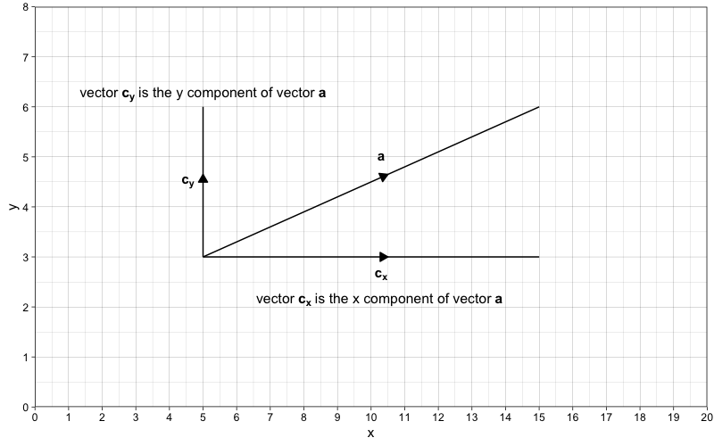{width=50%}
- **Zero vector**
  - **Concept**
    - A vector that has zero magnitude and no direction
    - Denoted as $\mathbf{0}$
- **Unit vector**
  - **Concept**
    - A vector that has a magnitude of 1
    - A unit vector is denoted by a hat on the vector (e.g. $\hat{\mathbf{v}}$)
- **Position vectors**
  - **Concept**
    - Vectors that stem from the origin 
    - Vectors that represent the position of a point in relation to the  origin $O$
    - A vector that represent the position of a point $P$ in relation to the origin $O$ would be denoted as $\overrightarrow{OP}$
    
    
```{r}
library(plotly)


vectors_plotly <- plot_ly() %>% add_trace(data = data.frame(x = c(0, 15), y = c(0, 20), z = c(0, 15)), x = ~x, y = ~z, z = ~y, mode = 'lines', line = list(color = "transparent")) %>% 
  add_trace(data = data.frame(x = c(5, 12), y = c(5, 5), z = c(8, 5)), x = ~x, y = ~z, z = ~y, mode = 'lines', line = list(color = "#930000", width = 5)) %>% 
  add_trace(data = data.frame(x = c(5, 5), y = c(5, 10), z = c(8, 8)), x = ~x, y = ~z, z = ~y, mode = 'lines', line = list(color = "#0023FF",  width = 5)) %>%
  add_trace(data = data.frame(x = c(5, 12), y = c(10, 5), z = c(8, 5)), x = ~x, y = ~z, z = ~y, mode = 'lines', line = list(color = "#000000",  width = 5)) %>%
  add_trace(data = data.frame(x = c(12, 12), y = c(5, 5), z = c(8, 5)), x = ~x, y = ~z, z = ~y, mode = 'lines', line = list(color = "#088800",  width = 5)) %>% 
  add_trace(data = data.frame(x = c(12, 5), y = c(5, 5), z = c(8, 8)), x = ~x, y = ~z, z = ~y, mode = 'lines', line = list(color = "#B8B200",  width = 5)) %>% 
  add_trace(data = data.frame(x = c(5, 12), y = c(10, 5), z = c(8, 5)), x = ~x, y = ~z, z = ~y, mode = 'markers', marker = list(color = "#000000", size = 5)) %>% layout(showlegend = F)


  #add_trace(
  #type= "cone",
  #x= c(5), y= c(8), z= c(10),
  #u= c(5), v= c(8), w= c(10),
  #anchor = "tip",
  #sizeref= c(0.1, 0.1), colorscale = list(c(0, 1), c("#001093", "#001093"))) %>% 
  #add_trace(
    #type= "cone",
    #x= c(12), y= c(5), z= c(5),
    #u= c(12), v= c(5), w= c(5),
    #anchor = "tip",
    #sizeref= c(0.1, 0.1), colorscale = list(c(0, 1), c("#930000", "#930000"))) %>% 
  #add_trace(
    #type= "cone",
    #x= c(12), y= c(5), z= c(5),
    #u= c(12), v= c(5), w= c(5),
    #anchor = "tip",
    #sizeref= c(0.1, 0.1), colorscale = list(c(0, 1), c("#930000", "#930000"))) %>% layout(showlegend = F)
  
#vectors_plotly 
  #add_trace(data = data.frame(x = c(12, 12), y = c(5, 5), z = c(8, 5)), x = ~x, y = ~z, z = ~y, mode = 'lines', line = list(color = "#656565"))
  
   #add_trace(data = data.frame(x = c(0, 5), y = c(0, 10), z = c(0, 8)), x = ~x, y = ~z, z = ~y, mode = 'lines', line = list(color = "#001093")) %>% 
  #add_trace(data = data.frame(x = c(0, 12), y = c(0, 5), z = c(0, 5)), x = ~x, y = ~z, z = ~y, mode = 'lines', line = list(color = "#930000"))

library(htmlwidgets)

saveWidget(vectors_plotly, "vectors_plotly.html", selfcontained = F, libdir = "lib")


#htmltools::tags$iframe(
  #src = "widgets/vectors_plotly.html", 
  #scrolling = "no", 
  #seamless = "seamless",
  #frameBorder = "0"
#)
```

    
**Resultant vector**
  - A vector that summaries a set of vectors
  - It is the vector that is the combined result of multiple vectors 
  - 
- **The triangle law for vector addition**
  - **Concept**
    - When 3 vectors are joined with the end of each vector linking with the end of another vector such that a closed triangle is formed, any one of those vectors is the combination of the other 2 vectors
    - Hence, the resultant vector of 2 vectors that are joined end-to-end (or successively put together) is the vector that would form a triangle when it is linked up with those two vectors
  - **Mathematics**
    - $\overrightarrow{AB} + \overrightarrow{BC} = \overrightarrow{AC}$
      - ***Where***
        - $\overrightarrow{AC}$ - The resultant vector 
  - **Graph**
    - 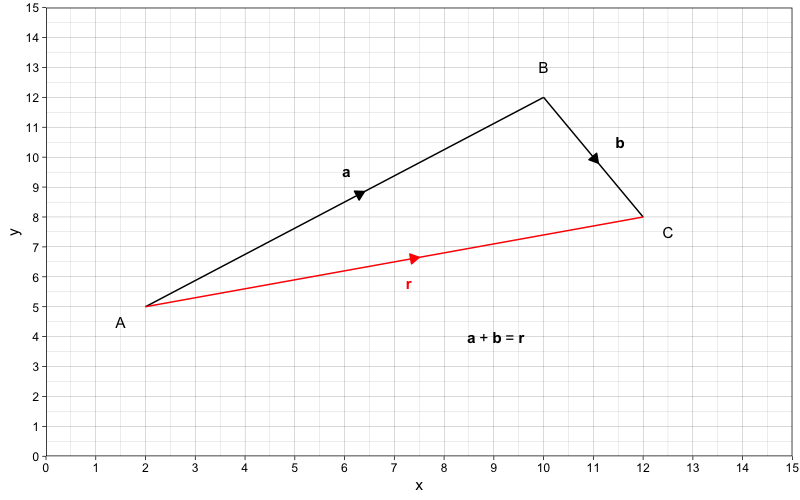{width=50%}
    
- **The polygon law of vector addition**
  - **Concept**
    - The resultant vector of 3 or more vectors is a vector that would form a closed polygon when it is linked up with the vectors that have been successively put together
    - You are basically applying the triangle law multiple times in succession 
  - **Mathematics**
    - $\overrightarrow{AB} + \overrightarrow{BC} + \overrightarrow{CD}= \overrightarrow{AD}$
  - **Visualisation**
    - 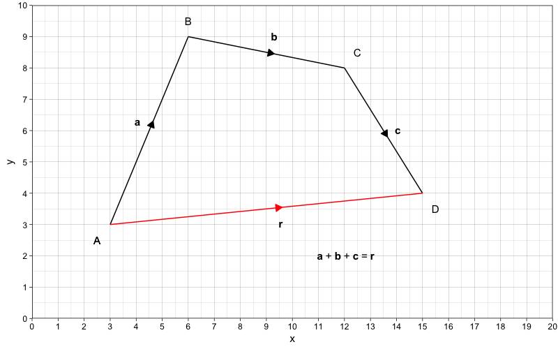{width=50%}
  - **Explanation**
    1. $\mathbf{r}$ is the resultant vector of vector $\mathbf{k}$ and $\mathbf{c}$
      - $\mathbf{r} = \mathbf{k} + \mathbf{c}$
      - 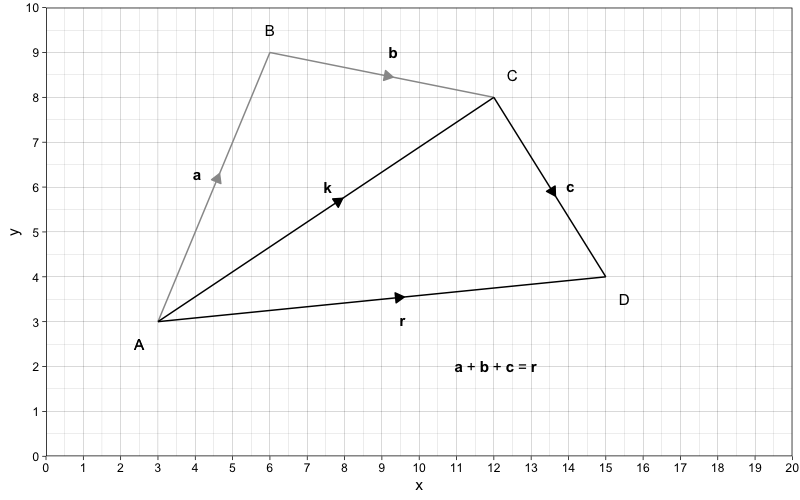
    2. $\mathbf{k}$ in turn is the resultant vector of vector $\mathbf{a}$ and $\mathbf{b}$
      - $\mathbf{k} = \mathbf{a} + \mathbf{b}$
      - 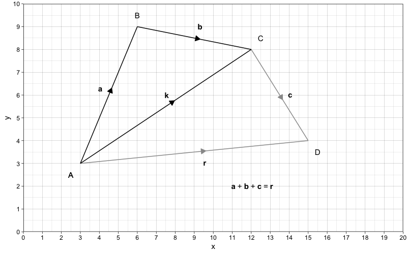
    3. Hence
      - $\mathbf{r} = \mathbf{k} + \mathbf{c}$
      - $\mathbf{r} = (\mathbf{a} + \mathbf{b}) + \mathbf{c}$
      - $\mathbf{r} = \mathbf{a} + \mathbf{b} + \mathbf{c}$

<p style = "margin-bottom: 0px; font-size: 20px; ">**Scalars**</p> 
  
- **Scalar**
  - **Concept**
    - Any numbers that are used to multiply another thing (e.g. variables or vectors)
    - It is called scalar because it is used to multiply or "scale' other things (e.g. variables or vectors)
    - It can also refer to any quantities that only has a magnitude or can be fully described using a magnitude (e.g. speed, mass)
    
- **Unit vectors parallel to the coordinate axes**
  - **Concept**
    - Unit vectors that are parallel to the coordinate axes
    - $\mathbf{i} = \begin{pmatrix} 1 \\ 0 \\ 0 \end{pmatrix}$ is a unit vector that is parallel to the x-axis 
    - $\mathbf{j} = \begin{pmatrix} 0 \\ 1 \\ 0 \end{pmatrix}$ is a unit vector and is parallel to the y-axis
    - $\mathbf{k} = \begin{pmatrix} 0 \\ 0 \\ 1 \end{pmatrix}$ is a unit vector and is parallel to the z-axis 
    - Hence, a 2-D vector $\mathbf{v} = \begin{pmatrix} x \\ y \end{pmatrix}$ can be written as $x\mathbf{i} + y\mathbf{j}$ and a 3-D vector $\mathbf{v} = \begin{pmatrix} x \\ y \\ z \end{pmatrix}$ can be written as $x\mathbf{i} + y\mathbf{j} + z\mathbf{k}$

- **Finding a unit vector parallel to a vector of interest**
  - **Concept**
    - A unit vector parallel to a vector of interest is the vector per the length of the vector 
    - Basically, you are scaling that vector such that it has a length of 1 (this is done by standardising the original vector per unit)
  - **Mathematics**
    - A unit vector parallel to vector $\mathbf{v}$ is $\frac{\mathbf{v}}{\mathbf{|v|}}$
  - **Example**
    - Consider a 2D vector $\mathbf{v} = \begin{pmatrix} 4 \\ 3 \end{pmatrix}$
    - The unit vector parallel to vector $\mathbf{v}$ is $\frac{\mathbf{v}}{\mathbf{|v|}} = \frac{\begin{pmatrix} 4 \\ 3 \end{pmatrix}}{5} = \begin{pmatrix} \frac{4}{5} \\ \frac{3}{5} \end{pmatrix}$
    
    
- **Distance between 2 points**
  - **Distance between 2 3-D points**
    - **Mathematics** 
      - $d_{1,2} = \sqrt{(x_{1}-x_{2})^{2}+(y_{1}-y_{2})^{2}+(z_{1}-z_{2})^{2}}$
    - **Explanation**
      - <iframe src="vectors_plotly.html" title="description" style="width:60em; height:25em; border: inherit; border-radius:10px;"></iframe>
      - Imagine that we need to find the distance between the 2 black dots (or the black vector)
      - To find the distance of the black vector, you need to first find the length of the blue and red vectors
      - Finding the length of the blue vector
        - Since the blue vector is parallel to the y-axis, the length of the blue vector can be found by the difference between the y-coordinates of the black dots 
        - $length~of~blue~vector = y_{1} - y_{2}$
      - Finding the length of the red vector 
        - Since the red vector is not parallel to any of the axes, to find the length of the red vector, we need to first find the length of the yellow and green vectors so that the length of the red vector can be found by using the Pythagoras' theorem 
        - Finding the length of the yellow vector 
          - Since the yellow vector is parallel to the x-axis, it can be found by the difference between the x-coordinates of the black dots
          - $length~of~yellow~vector = x_{1} - x_{2}$
        - Finding the length of the green vector 
          - Since the green vector is parallel to the z-axis, it can be found by the difference between the z-coordinates of the black dots
          - $length~of~green~vector = z_{1} - z_{2}$
        - Now that we know the length of the yellow and green vectors, we can apply the Pythagoras' theorem to find the length of the red vector
          - $length~of~red~vector = \sqrt{(length~of~yellow~line)^2+(length~of~green~vector)^2}$
          - $length~of~red~vector = \sqrt{(x_{1} - x_{2})^2+(z_{1} - z_{2})^2}$
      - Now that we know the length of the red vector and the blue vector we found earlier, we can apply the Pythagoras' theorem to find the black vector
        - $length~of~black~vector = \sqrt{(length~of~red~line)^2+(length~of~blue~vector)^2}$
        - $length~of~black~vector = \sqrt{(\sqrt{(x_{1} - x_{2})^2+(z_{1} - z_{2})^2})^2+(y_{1} - y_{2})^2}$
        - $length~of~black~vector = \sqrt{(x_{1} - x_{2})^2+(z_{1} - z_{2})^2+(y_{1} - y_{2})^2}$
        - $length~of~black~vector = \sqrt{(x_{1} - x_{2})^2+(y_{1} - y_{2})^2+(z_{1} - z_{2})^2}$
   

- **Other concepts**
  - Two vectors are equal if have the same magnitude and direction
  - One vector is the negative of another vector if they have the same magnitude but opposite direction
  - One vector is a scalar multiple of another vector if they have the same direction but different magnitude (they are scaled versions of each other)
  - Collinear points are points that line on the same straight line 
  
```{r}
library(ggplot2)
library(tidyverse)
library(magick)
library(latex2exp)


png(file = "image/dot_product.1.png", res = 100, width = 800, height = 500)
ggplot2::ggplot() + 
  scale_x_continuous(limits = c(0, 16), breaks = seq(0, 22, 1)) +
  scale_y_continuous(limits = c(0, 20), breaks = seq(0, 22, 1)) +
  geom_arrowsegment(aes(x = 2, y = 4, xend = 6, yend = 20), arrow_positions = 1, arrows = arrow(type = "closed", length = unit(0.12, "inches")),  arrow_fills = "black",  colour = "black", size = 0.6) + 
  geom_arrowsegment(aes(x = 2, y = 4, xend = 14, yend = 8), arrow_positions = 1, arrows = arrow(type = "closed", length = unit(0.12, "inches")),  arrow_fills = "black",  colour = "black", size = 0.6) +
  annotate(geom = "text", x = 3, y = 5, label = TeX("$\\theta{}$")) +
  annotate(geom = "text", x = 3, y = 12, label= TeX("$\\textbf{a}$")) +
  annotate(geom = "text", x = 8, y = 5, label= TeX("$\\textbf{b}$")) +
  coord_fixed() + theme_minimal()
dev.off()
  
png(file = "image/dot_product.2.png", res = 100, width = 800, height = 500)
#The red vector is a vector that represents how much vector a is moving in the direction of vector b
ggplot2::ggplot() + 
  scale_x_continuous(limits = c(0, 16), breaks = seq(0, 22, 1)) +
  scale_y_continuous(limits = c(0, 20), breaks = seq(0, 22, 1)) +
  geom_arrowsegment(aes(x = 2, y = 4, xend = 6, yend = 20), arrow_positions = 1, arrows = arrow(type = "closed", length = unit(0.12, "inches")),  arrow_fills = "black",  colour = "black", size = 0.6) + 
  geom_arrowsegment(aes(x = 2, y = 4, xend = 14, yend = 8), arrow_positions = 1, arrows = arrow(type = "closed", length = unit(0.12, "inches")),  arrow_fills = "black",  colour = "black", size = 0.6) +
  annotate(geom = "segment", x = 6, y = 20, xend = 10.4, yend = 6.8, color = "black", size = 0.35, linetype = "dashed") +
  geom_arrowsegment(aes(x = 2, y = 4, xend = 10.4, yend = 6.8), arrow_positions = 1, arrows = arrow(type = "closed", length = unit(0.12, "inches")),  arrow_fills = "red",  colour = "red", size = 0.35) +
  annotate(geom = "text", x = 3, y = 5, label = TeX("$\\theta{}$")) +
  annotate(geom = "text", x = 3, y = 12, label= TeX("$\\textbf{a}$")) +
  annotate(geom = "text", x = 8, y = 5, label= TeX("$\\textbf{b}$")) +
  annotate(geom = "text", x = 9, y = 7.5, label = TeX("90$^\\circ$")) +
  annotate(geom = "text", x = 31/5, y = 6, label = expression(bold(a)[bold(b)]), color = "red") +
  coord_fixed() + theme_minimal() 
dev.off()
#Using basic trigonometry, the red vector is |a|Cos theta 
#If we multiply the red vector with b, then it is the interaction between a and b in the direction of b


png(file = "image/dot_product.3.png", res = 100, width = 800, height = 500)
#The blue vector is the vector that represents how much vector b is moving in the direction of vector a
ggplot2::ggplot() + 
  scale_x_continuous(limits = c(0, 16), breaks = seq(0, 22, 1)) +
  scale_y_continuous(limits = c(0, 20), breaks = seq(0, 22, 1)) +
  geom_arrowsegment(aes(x = 2, y = 4, xend = 6, yend = 20), arrow_positions = 1, arrows = arrow(type = "closed", length = unit(0.12, "inches")),  arrow_fills = "black",  colour = "black", size = 0.6) + 
  geom_arrowsegment(aes(x = 2, y = 4, xend = 14, yend = 8), arrow_positions = 1, arrows = arrow(type = "closed", length = unit(0.12, "inches")),  arrow_fills = "black",  colour = "black", size = 0.6) +
  annotate(geom = "segment", x = 14, y = 8, xend = 62/17, yend = 180/17, color = "black", size = 0.35, linetype = "dashed") +
  geom_arrowsegment(aes(x = 2, y = 4, xend = 62/17, yend = 180/17), arrow_positions = 1, arrows = arrow(type = "closed", length = unit(0.12, "inches")),  arrow_fills = "blue",  colour = "blue", size = 0.35) +
  annotate(geom = "text", x = 3, y = 5, label = TeX("$\\theta{}$")) +
  annotate(geom = "text", x = 3, y = 12, label= TeX("$\\textbf{a}$")) +
  annotate(geom = "text", x = 8, y = 5, label= TeX("$\\textbf{b}$")) +
  annotate(geom = "text", x = 4.5, y = 9.25, label = TeX("90$^\\circ$")) +
  annotate(geom = "text", x = 3.5, y = 124/17, label = expression(bold(b)[bold(a)]), color = "blue") +
  coord_fixed() + theme_minimal() 
dev.off()
#Using basic trigonometry, the blue vector is |b|Cos
#If we multiply the blue vector with a, then it is the interaction between a and b in the direction of b
#|b|Cos x |a|

#We see that their interaction with respect to either a or b is the same, this is duality 

#But because of duality 


image_write(image_crop(image_read("image/dot_product.1.png"), "450x500+180"), path = "image/dot_product_magick.1.png", format = "png")
image_write(image_crop(image_read("image/dot_product.2.png"), "450x500+180"), path = "image/dot_product_magick.2.png", format = "png")
image_write(image_crop(image_read("image/dot_product.3.png"), "450x500+180"), path = "image/dot_product_magick.3.png", format = "png")
```
- **Dot product of 2 vectors**
  - **Concept**
    - The dot product basically quantifies the extent to which 2 vectors interact with each other (or how much each of the two vectors reinforce each other in their magnitude)
    - When the vectors are orthogonal to each other, in other words, they don't interact with each other, then they have a dot product of $0$ (because when 2 vectors are orthogonal, $\theta = 90$, and $\cos{90} = 0$, therefore, the dot product is $0$ )
    - When 2 vectors are parallel to each other, in other words, they full interact with each other, then they have a dot product of $|\mathbf{a}||\mathbf{b}|$
  - **Mathematics** 
    - **The usual form**
      - $\mathbf{a} \cdot \mathbf{b} = |\mathbf{a}||\mathbf{b}|\cos{\theta}$
    - **The component form**
      - $\mathbf{a} \cdot \mathbf{b} = \sum_{i=1}^{d}{a_{d}b_{d}}$
      - $\mathbf{a} \cdot \mathbf{b} = a_{1}b_{1} + a_{2}b_{2} + a_{3}b_{3} + \cdots + a_{d}b_{d}$
        - ***Where***
          - $a_{d}$ - The magnitude of vector $\mathbf{a}$ in the direction of the d axis
          - $b_{d}$ - The magnitude of vector   $\mathbf{b}$ in the direction of the d axis
          - $a_{d}b_{d}$ - The combined magnitude of vectors $\mathbf{a}$ and $\mathbf{b}$ in the direction of the d-axis
          - $d$ - The total number of dimensions
  - **Explanation**
    - Given 2 2-D vectors, vector $\mathbf{a}$ and vector $\mathbf{b}$
      - 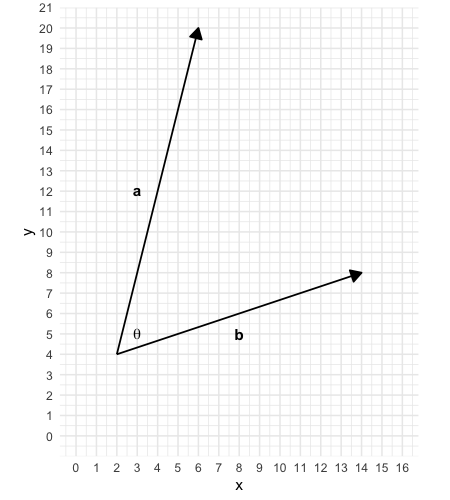{width=50%}
    - **The combined magnitude of** $\mathbf{a}$ **and** $\mathbf{b}$ **in the direction of** $\mathbf{b}$
      - The magnitude of $\mathbf{a}$ in the direction of $\mathbf{b}$ ($\mathbf{a}_{\mathbf{b}}$) can be found using the ratio of $\cos{}$
        - $\mathbf{a}_{\mathbf{b}} = |\mathbf{a}|\cos{\theta}$
        - 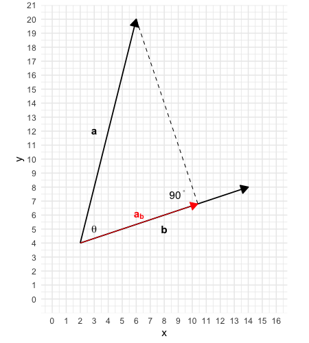{width=50%}
      - The combined magnitude of $\mathbf{a}$ and $\mathbf{b}$ in the direction of $\mathbf{b}$ is the multiplicative effect between the magnitude of $\mathbf{a}$ in the direction of $\mathbf{b}$ (or $\mathbf{a}_{\mathbf{b}}$) and the magnitude of $\mathbf{b}$
        - $\mathbf{a}\cdot\mathbf{b} = |\mathbf{a}|\cos{\theta} |\mathbf{b}|$
    - **The combined magnitude of** $\mathbf{a}$ **and** $\mathbf{b}$ **in the direction of** $\mathbf{a}$
      - The magnitude of $\mathbf{b}$ in the direction of $\mathbf{a}$ ($\mathbf{b}_{\mathbf{a}}$) can be found using the ratio of $\cos{}$
        - {width=50%}
        - $\mathbf{b}_{\mathbf{a}} = |\mathbf{b}|\cos{\theta}$
      - The combined magnitude of $\mathbf{a}$ and $\mathbf{b}$ in the direction of $\mathbf{a}$ is multiplicative effect between the magnitude of $\mathbf{a}$ in the direction of $\mathbf{a}$ (or $\mathbf{b}_{\mathbf{a}}$) and the magnitude of $\mathbf{a}$
        - $\mathbf{a}\cdot\mathbf{b} = |\mathbf{b}|\cos{\theta}|\mathbf{a}|$
    - **Duality**
      - We can see that the combined magnitude of $\mathbf{a}$ and $\mathbf{b}$ in the direction of $\mathbf{b}$ is exactly the same as the combined magnitude of $\mathbf{a}$ and $\mathbf{b}$ in the direction of $\mathbf{a}$. Hence, the order does not matter ($\mathbf{a}\cdot\mathbf{b} = \mathbf{b}\cdot\mathbf{a}$)
  - **Alternative thinking**
    - $|\mathbf{a}||\mathbf{b}|$ is the maximum possible amount of interaction between the 2 vectors
    - $\cos{\theta}$ is like a quantity that quantifies how much the 2 vectors project to the same direction as each other. This quantity ranges from -1 to +1. +1 means that the 2 vectors are fully in the same direction. 
      - When the 2 vectors are entirely in the same direction, then $\theta = 0$ and $\cos{90} = 1$
      - When the 2 vectors are entirely in the opposite direction, then $\theta = 180$ and $\cos{180} = -1$
      - When the 2 vectors are orthogonal to each other, then $\theta = 90$ and $\cos{90} = 0$ 
    - $|\mathbf{a}||\mathbf{b}| \cos{\theta}$ is like scaling $|\mathbf{a}||\mathbf{b}|$ by the factor $\cos{\theta}$ such that the result reflects the amount of interaction between the 2 vectors
      - When $\cos{90} = 1$, then you get the maximum possible amount of interaction 
      - When $\cos{180} = -1$, then you get maximum possible amount of interaction 
      - When $\cos{0} = 0$, then you 0 percent of that interaction 
  - **Other tips**
    - $\mathbf{a} \cdot (\mathbf{b} + \mathbf{c}) = \mathbf{a} \cdot\mathbf{b} + \mathbf{a} \cdot\mathbf{c}$
       
      
```{r dot_product_gif}

dot_product_magick.1 <- image_read("image/dot_product.1.png")
dot_product_magick.3 <- image_read("image/dot_product.3.png")
image_scale(c(dot_product_magick.1, dot_product_magick.3), "700")
image_crop(image_animate(image_scale(c(dot_product_magick.1, dot_product_magick.3), "600"), 0.5), "450x500+180")
image_write(image_crop(image_animate(image_scale(c(dot_product_magick.1, dot_product_magick.3, dot_product_magick.1), "600"), 2), "450x500+180"), "dot_product.gif")

image_read("dot_product.gif")
image_crop(image_read("image/dot_product.1.png"))
image_animate(
  image_scale(c(dot_product_magick.1, dot_product_magick.3), "400"),
  fps = 5, 
  loop = 5)
```

```{r michael_scott_gif}
library(magick)
michael_scott.1 <- image_read("image/michael_scott.1.png")
michael_scott.2 <- image_read("image/michael_scott.2.png")
image_scale(c(michael_scott.1, michael_scott.2), "500")
image_animate(image_scale(c(michael_scott.1, michael_scott.2), "500"), fps = 2)
image_write(image_animate(image_scale(c(michael_scott.1, michael_scott.2), "500"), fps = 2), "michael_scott.gif")
image_read("michael_scott.gif")

```


```{r}
library(gapminder)
library(ggplot2)
library(gganimate)

gganimate.1 <- ggplot(gapminder, aes(gdpPercap, lifeExp, colour = country)) +
  geom_point(alpha = 0.7, show.legend = FALSE) +
  scale_colour_manual(values = country_colors) +
  scale_size(range = c(2, 12)) +
  scale_x_log10() +
  facet_wrap(~continent) +
  # Here comes the gganimate specific bits
  labs(title = 'Year: {frame_time}', x = 'GDP per capita', y = 'life expectancy') +
  transition_time(year) +
  ease_aes('linear')
#gganimate.1

```


```{r include = F, echo = F}
tbdat <- read_csv("https://drmankin.github.io/disc_stats/cogstyles_clean.csv") %>% dplyr::mutate(common_factor = "sample", common_factor = as.factor(common_factor))
tbdat.2 <- tbdat %>% dplyr::mutate(gen_cat = ifelse(gender_id >= 50, "f", "m"), gen_cat = as.factor(gen_cat)) %>% select(scsq_technical_spatial, scsq_imagery_ability,scsq_lang_words,  scsq_global_bias, scsq_systematising, scsq_organisation, cais_score, eq_score, loc_internal, loc_others, loc_chance, rat_score, tas_identifying,tas_describing, tas_ext_thinking , common_factor, gen_cat)

```

```{r include = F, echo = F}
ccc_data <- readxl::read_xlsx("./data/ccc_data.xlsx") %>% dplyr::mutate(sample = "sample", sample = as.factor(sample), Gender = as.factor(Gender)) %>% filter(Gender != 2)

ggplot2::ggplot(data = ccc_data, mapping = aes(x = Gender, y = ExperimentDuration)) + geom_violin()

tbdat.2
summarise(group_by(tbdat.2, gen_cat) , mean = mean(loc_chance))

png(file = "image/loc_chance.png", res = 100, width = 800, height = 500)
ggplot2::ggplot(data = tbdat.2, mapping = aes(x = gen_cat, y = loc_chance, fill = gen_cat)) + scale_fill_manual(values=c("#E500B8", "#008EE5")) + geom_violin(alpha = 0.39, color = "black") +  geom_boxplot(width=0.05, fill=c("#A90000", "#0014A9"), color = "black", alpha = 0.6) + scale_y_continuous(limits = c(5, 45), expand = c(0,0)) +scale_x_discrete(expand = c(0.5,0.5)) + geom_point(data = summarise(group_by(tbdat.2, gen_cat) , mean = mean(loc_chance)), aes(x = gen_cat, y = mean), size = 12, color = "black", fill = c("#8B0000", "#0014A9"), shape = 21, stroke = 1) + theme_minimal()
dev.off()

loc_chance_magick <- image_read("image/loc_chance.png")
loc_chance_magick.2 <- image_crop(loc_chance_magick, "450x500+180")
image_blur(loc_chance_magick, 10, 5)
image_trim(loc_chance_magick)
#stat_summary(fun.data = mean_sdl, colour = "red")
```
  
  
  
  
  
  
  
  
  
  
  
  
  
  
  
  
  
  
  
  
