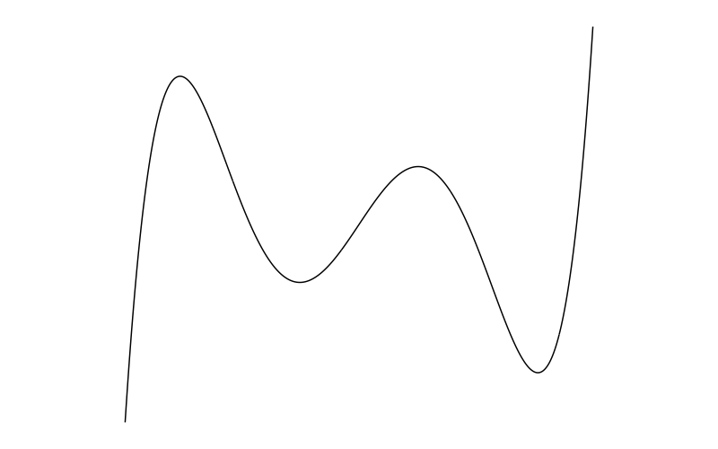

# Mathematics


## Functions 

<p style = "margin-bottom: 0px; font-size: 20px; ">**Functions**</p>

- **Concept**
  - **Function** - A mathematical relational expression that maps each value of a set of inputs to a single output 
- **Related concepts**
  - **Domain of a function** - The set of possible inputs for a function 
  - **Range of a function** - The set of possible outputs of a function 
  - **Root of a function** - The values of x for which the output is 0 ($f(x) = 0$)
  - **Inverse of a function** - A function that is a reversal of another function (it reverses the subject)
- **The components of a function**
  - **Variables**
    - **Concept**
      - Aka indeterminates
      - **Variable** - Anything that can vary in quantity 
      - A function consists of variables of which the output is a function (in other words, a function consists of variables that varies with the outcome variable)
  - **Coefficient**
    - **Concept**
      - **Coefficients** - Constants that act as multipliers for the variables
    - **The intercept**
      - **Concept**
        - The intercept is the coefficient for the variable with an exponent of 0
      - **What the intercept tells us??**
        - **In general sense**
          - The intercept defines the change on the y-axis from the x-axis in addition to the terms with variables in the function. In terms of graphical transformation, the intercept defines how the graph of the function is shifted on the y-axis from the x-axis 
        - **In terms of the intercept**
          - The intercept defines the y value when x = 0 (or the value of $f(0)$). In terms of graphical transformation, the intercept defines the value of y in the coordinate of the graph that touches the y-axis 
- <details><summary>**Some Useful Functions**</summary>
  - **General**
    - Exponential 
    - Log and ln
    - Circle
    - Reciprocal
  - **Polynomial Functions**
    - Linear
    - Quadratic
    - Cubic
    - Quartic
    - Quintic
  - **Trigonometric Functions**
    - **Ordinary Trigonometric Functions**
      - Sine
      - Cosine
      - Tangent
    - **Hyperbolic Functions**
      - Hyperbolic Sine
      - Hyperbolic Cosine
      - Hyperbolic Tangent 
  - **Probability/Distributional Functions (Probability and Cumulative)**
    - **Probability Density Function**
      - Normal Distribution
      - Chi-squared Distribution
      - Log-Normal Distribution
      - Exponential Distribution
      - F Distribution
    - **Probability Mass Function**
      - Binomial Distribution
      - Poisson Distribution
      - Bernoulli Distribution
      - Rademacher Distribution </details>
      


<p style = "margin-bottom: 0px; font-size: 20px; ">**Polynomial Functions**</p>

- **Concept**
  - **Polynomial functions** - Functions that are made up of the sum of one or more algebraic terms each of which is the product of a coefficient and one or more variables each of which has a non-negative integer exponent 
  - **The Leading Coefficient** - The coefficient of the variable term with the highest degree or the largest exponent in a polynomial function - The leading coefficient in a polynomial function must not be 0
  - **Degree of a polynomial**
    - The highest possible degree of the polynomial's monomial (individual terms) with non-zero coefficients (the degree of a term is the exponent of the variable)
- **Types of Polynomial Function**
  - **Polynomials by degree**
    - A constant (degree of 0)
    - Linear (degree of 1)
    - Quadratic (degree of 2)
    - Cubic (degree of 3)
    - Quartic (degree of 4)
    - Quintic (degree of 5)
    - and so on... 


<p style = "margin-bottom: 0px; font-size: 20px; ">**The Linear Function**</p>
- **The Linear Function**
  - **Concept**
    - The linear function describes the output as a linear function of one variable (variable x)
    - Aka a polynomial with a degree of 1 
  - **Mathematics**
    - $f(x) = ax + b$
- **The Linear Equation**
  - **Concept**
    - The univariate univariable linear equation is an equation that describes a variable (variable y) as a linear function of another variable (variable x)
  - **Mathematics**
    - $y = ax + b$
      - ***Where***
        - $y$ 
          - Variable y (A variable represented on the y-axis)
          - This variable is usually the output or the variable of interest, which is also called the outcome variable or the dependent variable (DV) in mathematical modelling
        - $x$ 
          - Variable x (A variable represented on the x-axis) 
          - This variable is usually the input, which is also called the predictor variable or the independent variable (IV) in mathematical modelling
        - $a$ 
          - The coefficient for $x$ 
          - It is the weight of the x variable on the y variable 
          - It defines the magnitude of the linear relationship x has on y 
          - Graphically, it defines the slope of the line 
        - $b$
          - The intercept  

```{r quadratic, include = F, echo = F}
library(dplyr)
library(ggplot2)


png(file = "image/quadratic.png", res = 100, width = 800, height = 500)
ggplot(data = as.tibble(data.frame(x = seq(-10, 10, by = 0.01))) %>% dplyr::mutate(y = (x^2)) ) + geom_line(mapping = aes(x = x, y = y)) + scale_y_continuous(limits = c(0, 110)) + scale_x_continuous(limits = c(-15, 15)) + theme_void()
dev.off()

```
          

<p style = "margin-bottom: 0px; font-size: 20px; ">**The Quadratic Function**</p>  
  - **The Quadratic Function**
    - **Concept**
      - The univariable quadratic function describes the output as a quadratic function of one variable
      - A function with a non-zero coefficient for any variables with an exponent of 2
      - In the factored form, it is the product of 2 linear factors 
  - **Mathematics**
    - $f(x) = ax^{2} + bx + c$
- **The Quadratic Equation**
  - **Concept**
    - The univariate univariable quadratic describes a variable (variable y) as a quadratic function of one variable (variable x)
  - **Mathematics**
    - $y = ax^{2} + bx + c$
      - ***Where***   
        - $a$ 
          - Coefficient for $x^{2}$
          - It is the weight of variable x on variable y
          - It defines the magnitude of the quadratic relationship x has on y
          - Graphically, it defines the slope of the quadratic curve
        - $b$ 
          - Coefficient for $x$
        - $c$ 
          - Intercept 
- **The Quadratic Graph**
  - {width=30%}
- **Real life examples**
  - Distance Travelled ($s = ut + \frac{1}{2}at^{2}$)
  - Yerkes and Dodson Law (performance is a negative quadratic function of arousal)
  - Bridges 
    - <details><summary>Sydney Barbour Bridge (Negative quadratic)</summary>{width=35%}</details>
    - <details><summary>Clifton Suspension Bridge (Positive quadratic)</summary> {width=35%}</details>
      
      
```{r cubic, include = F, echo = F}
library(dplyr)
library(ggplot2)

png(file = "image/cubic.png", res = 100, width = 800, height = 500)
ggplot(data = as.tibble(data.frame(x = seq(-8, 6, by = 0.01))) %>% dplyr::mutate(y = (x^(3) + 5*(x^(2)) + x))) + geom_line(mapping = aes(x = x, y = y)) +
  scale_y_continuous(limits = c(-70, 70)) +
  scale_x_continuous(limits = c(-15, 15)) +
  theme_void()


png(file = "image/cubic.2.png", res = 100, width = 800, height = 500)
ggplot(data = as.tibble(data.frame(x = seq(-2.5, 2.5, by = 0.01))) %>% dplyr::mutate(y = (x^(3)))) + 
  geom_line(mapping = aes(x = x, y = y)) +
  scale_x_continuous(limits = c(-5,5), breaks = seq(-5, 5, 1)) +
  scale_y_continuous(breaks = seq(-20, 20, 5)) + theme_void()
  
dev.off()

```
  
<p style = "margin-bottom: 0px; font-size: 20px; ">**The Cubic Function**</p>  

- **The Cubic Function**
  - **Concept**
    - The univariable cubic function describes the output as a cubic function of one variable (variable x)
    - The cubic function has a non-zero coefficient for any variables with an exponent of 3
    - In the factored form, it is the product of 3 linear factors or the product of a linear factor and a quadratic factor 
- **Mathematics**
  - $f(x)= ax^{3} + bx^{2} + cx + d$
- **The Cubic Equation**
  - **Concept**
    - The univariate univariable cubic equation describes a variable (variable y) as a cubic function of one variable (variable x)
  - **Mathematics**
    - $y = ax^{3} + bx^{2} + cx + d$
      - ***Where***
        - $a$ - Coefficient for $x^{3}$
        - $b$ - Coefficient for $x^{2}$
        - $c$ - Coefficient for $x$
        - $d$ - Intercept
- **The Cubic Curve**
  - {width=30%}
  - {width=30%}


```{r quartic, include = F, echo = F}
library(dplyr)
library(ggplot2)

png(file = "image/quartic.png", res = 100, width = 800, height = 500)
ggplot(data = as.tibble(data.frame(x = seq(-10, 10, by = 0.01))) %>% dplyr::mutate(y = (0.6*x+1.8)*(x+1)*(x-1)*(x-5))) + geom_line(mapping = aes(x = x, y = y)) +
  scale_y_continuous(limits = c(-70, 70)) +
  scale_x_continuous(limits = c(-10, 10)) +
  theme_void()
dev.off()

```
  
  
 <p style = "margin-bottom: 0px; font-size: 20px; ">**The Quartic Function**</p>  
 
 - **The Quartic Function**
  - **Concept**
    - The univariable univariate quartic function describes the output as a quartic function of one variable (variable x)
    - The leading coefficient must be non-zero, in quartic functions, it means that the coefficient for any variables with an exponent of 4 must be non-zero
    - In the factored form, it can be the product of 
      - 4 linear factors
      - 2 quadratic factors
      - 1 linear factor and 1 cubic factor 
  - **Mathematics**
    - $f(x)= ax^{4} + bx^{3} + cx^{2} + dx + e$
- **The Quartic Equation** 
  - **Concept**
    - The univariate univariable quartic equation describes a variable (variable y) as a quartic function of one variable (variable x)
    - ***Where*** 
      - $a$ - Coefficient of $x^4$ 
      - $b$ - Coefficient of $x^3$ 
      - $c$ - Coefficient of $x^2$ 
      - $d$ - Coefficient of $x$
      - $e$ - Intercept
- **The Quartic graph**
  - {width=30%}
  
```{r quintic, include = F, echo = F}
library(dplyr)
library(ggplot2)

png(file = "image/quintic.png", res = 100, width = 800, height = 500)
ggplot(data = as.tibble(data.frame(x = seq(-10, 10, by = 0.01))) %>% dplyr::mutate(y = x^(5) - 5*x^(4) + 5*x^(3) + 5*x^(2) -6*x)) + geom_line(mapping = aes(x = x, y = y)) +
  scale_y_continuous(limits = c(-5, 5)) +
  scale_x_continuous(limits = c(-2, 4)) +
  theme_void()
dev.off()

```  
  
  
<p style = "margin-bottom: 0px; font-size: 20px; ">**The Quintic Function**</p>  

- **The Quintic Function**
 - **Concept**
  - The univariable univariate quintic function describes the output as a quintic function of one variable (variable x)
  - The leading coefficient must be non-zero, in quintic functions, this means that the coefficient for any variables with an exponent of 5 must be non-zero
  - In the factored form, it can be the product of 
    - 5 linear factors
    - 3 linear factors and 1 quadratic factor
    - 2 linear factors and 1 cubic factor 
    - 1 linear factor and 2 quadratic factors
    - 1 linear factor and 1 quartic factors 
    - 1 quadratic factor and 1 cubic factor 
 - **Mathematics**  
  - $f(x) = ax^{5} + bx^{4} + cx^{3} + dx^{2} + ex + f$
- **The Quintic Equation**
  - **Concept**
    - The univariate univariable quintic equation describes a variable (variable y) as a quintic function of one variable (variable x)
  - **Mathematics**
  - $y = ax^{5} + bx^{4} + cx^{3} + dx^{2} + ex + f$
    - ***Where*** 
      - $a$ - Coefficient of $x^5$
      - $b$ - Coefficient of $x^4$
      - $c$ - Coefficient of $x^3$
      - $d$ - Coefficient of $x^2$
      - $e$ - Coefficient of $x$
      - $f$ - Intercept
- **The Quintic Graph**
  - {width=30%}
  
  
  
  
  
  
  
  
  
  
  
  
  
  
