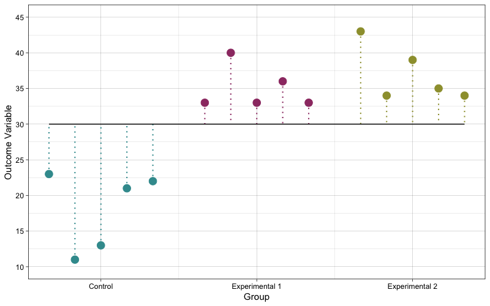
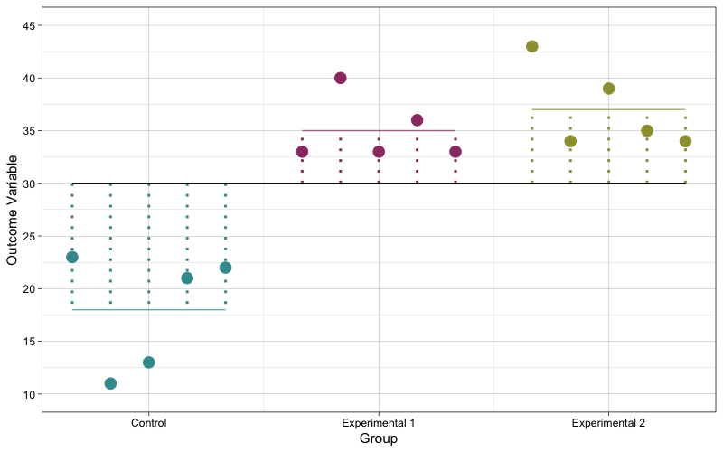
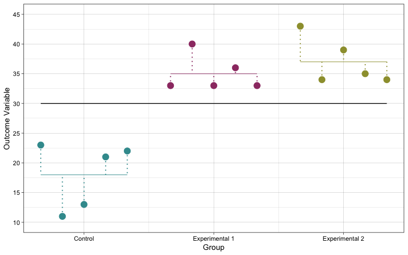

# ANOVA

```{r functions, include = F, echo = F}
library(forcats)
library(ggplot2)
library(tidyverse)

#GGANOVA
#A function that makes a One-Way ANOVA plot 
## This function depends on base r, utils, and ggplot2 functions
gganova <- function(
    formula = NULL, 
    data = NULL,
    geom_point = list(),
    geom_segment.group.mean = list(),
    geom_segment.resid = list(),
    geom_segment.grand.mean = list(),
    geom_segment.TD = list(),
    geom_segment.MD = list(),
    spacing = 1,
    labels = c()){
#Function starts
if(spacing < 1) {stop("spacing cannot be smaller than 1 you fucking idiot!!!")}
formula <- formula
y <- gsub(" ", "", strsplit(formula, "[~]")[[1]][1], fixed = TRUE)
factor <- gsub(" ", "", strsplit(formula, "[~]")[[1]][2], fixed = TRUE)
dat <- data[, c(y,factor)]
##Making the grouping variable as a factor 
#dat[, which( colnames(dat)==factor)] <- as.factor(dat[, which( colnames(dat)==factor)])
nlevels <- nlevels(dat[,2])
#labelz <- labels
#labels.2 <- c(labelz)
#mean_dat.2 <- data.frame()
dat.2 <- data.frame()
bins.loop <- c() 
plot <- ggplot2::ggplot()
#counter <- 1 #THIS IS ONLY FOR CHECKING PURPOSES
for(counter in 1:nlevels){

split_dat  <- rownames_to_column(data.frame(split(dat, dat[2])[counter]))[-1]


names(split_dat)[1] <- "y"
names(split_dat)[2] <- "factor"

#mean_dat <- data.frame(factor_level = c(split_dat$group[1]) , group_mean = c(mean(t(split_dat[1]))))
#mean_dat.2 <- rbind(mean_dat.2, mean_dat)
split_dat <- transform(split_dat, predicted_value = mean(t(split_dat[1]), na.rm = TRUE))
split_dat <- transform(
  split_dat, 
  geom_point.colour = ifelse(!is.null(geom_point$colour), ifelse(!is.na(geom_point$colour[counter]),geom_point$colour[counter],"black"), "black"), 
  geom_point.fill = ifelse(!is.null(geom_point$fill), ifelse(!is.na(geom_point$fill[counter]),geom_point$fill[counter],"black"), "black"),
  geom_point.shape = ifelse(!is.null(geom_point$shape), ifelse(!is.na(geom_point$shape[counter]),geom_point$shape[counter],4), 4),
  geom_point.size = ifelse(!is.null(geom_point$size), ifelse(!is.na(geom_point$size[counter]),geom_point$size[counter],2), 2),
  geom_point.alpha = ifelse(!is.null(geom_point$alpha), ifelse(!is.na(geom_point$alpha[counter]),geom_point$alpha[counter],1), 1),
  
  geom_segment.group.mean.colour = ifelse(!is.null(geom_segment.group.mean$colour), ifelse(!is.na(geom_segment.group.mean$colour[counter]),geom_segment.group.mean$colour[counter],"black"), "black"), 
  geom_segment.group.mean.linetype = ifelse(!is.null(geom_segment.group.mean$linetype), ifelse(!is.na(geom_segment.group.mean$linetype[counter]),geom_segment.group.mean$linetype[counter],"solid"), "solid"),
  geom_segment.group.mean.size = ifelse(!is.null(geom_segment.group.mean$size),  ifelse(!is.na(geom_segment.group.mean$size[counter]), geom_segment.group.mean$size[counter],1), 1),
  geom_segment.group.mean.alpha = ifelse(!is.null(geom_segment.group.mean$alpha),  ifelse(!is.na(geom_segment.group.mean$alpha[counter]),geom_segment.group.mean$alpha[counter],1), 1),
  
  geom_segment.resid.colour = ifelse(!is.null(geom_segment.resid$colour),  ifelse(!is.na(geom_segment.resid$colour[counter]), geom_segment.resid$colour[counter], "black"), "black"), 
  geom_segment.resid.linetype = ifelse(!is.null(geom_segment.resid$linetype),  ifelse(!is.na(geom_segment.resid$linetype[counter]), geom_segment.resid$linetype[counter], "dotted"), "dotted"),
  geom_segment.resid.size = ifelse(!is.null(geom_segment.resid$size),  ifelse(!is.na(geom_segment.resid$size[counter]), geom_segment.resid$size[counter], 0.5), 0.5), 
  geom_segment.resid.alpha = ifelse(!is.null(geom_segment.resid$alpha),  ifelse(!is.na(geom_segment.resid$alpha[counter]), geom_segment.resid$alpha[counter],1), 1),
  
  geom_segment.TD.colour = ifelse(!is.null(geom_segment.TD$colour),  ifelse(!is.na(geom_segment.TD$colour[counter]), geom_segment.TD$colour[counter], "black"), "black"), 
  geom_segment.TD.linetype = ifelse(!is.null(geom_segment.TD$linetype),  ifelse(!is.na(geom_segment.TD$linetype[counter]), geom_segment.TD$linetype[counter], "dotted"), "dotted"),
  geom_segment.TD.size = ifelse(!is.null(geom_segment.TD$size),  ifelse(!is.na(geom_segment.TD$size[counter]), geom_segment.TD$size[counter], 0.5), 0.5), 
  geom_segment.TD.alpha = ifelse(!is.null(geom_segment.TD$alpha),  ifelse(!is.na(geom_segment.TD$alpha[counter]), geom_segment.TD$alpha[counter],1), 1),
  
  geom_segment.MD.colour = ifelse(!is.null(geom_segment.MD$colour),  ifelse(!is.na(geom_segment.MD$colour[counter]), geom_segment.MD$colour[counter], "black"), "black"), 
  geom_segment.MD.linetype = ifelse(!is.null(geom_segment.MD$linetype),  ifelse(!is.na(geom_segment.MD$linetype[counter]), geom_segment.MD$linetype[counter], "dotted"), "dotted"),
  geom_segment.MD.size = ifelse(!is.null(geom_segment.MD$size),  ifelse(!is.na(geom_segment.MD$size[counter]), geom_segment.MD$size[counter], 0.5), 0.5), 
  geom_segment.MD.alpha = ifelse(!is.null(geom_segment.MD$alpha),  ifelse(!is.na(geom_segment.MD$alpha[counter]), geom_segment.MD$alpha[counter],1), 1),
  
  custom.label = ifelse(!is.null(labels), labels[counter], NA),
  grand.mean =  mean(dat[,1], na.rm = TRUE)
  )
split_dat[nrow(split_dat)+spacing,] <- NA ##Argument: Spacing
split_dat <- transform(split_dat, level_number = counter)
dat.2 <- rbind(dat.2, split_dat)

dat.3 <- dat.2
dat.3[-c(c(nrow(dat.3)-1):nrow(dat.3)),]
dat.3$y[dat.3$level_number != counter] <- NA
dat.3$predicted_value[dat.3$level_number != counter] <- NA
dat.3$rowid <- seq.int(nrow(dat.3))

bins.loop <- c(bins.loop, c(((tail(dat.3[dat.3$level_number == counter,]$rowid, n=1) - spacing) + head(dat.3[dat.3$level_number == counter,]$rowid, n=1))/2))
bins <- c(bins.loop)

plot <- plot + 
  geom_point(
    data = dat.3[dat.3$level_number == counter,], 
    mapping = aes(x = rowid, y = y), 
    colour = dat.3[dat.3$level_number == counter,][,"geom_point.colour"][1], 
    fill = dat.3[dat.3$level_number == counter,][,"geom_point.fill"][1], 
    shape = dat.3[dat.3$level_number == counter,][,"geom_point.shape"][1], 
    size = dat.3[dat.3$level_number == counter,][,"geom_point.size"][1],
    alpha = dat.3[dat.3$level_number == counter,][,"geom_point.alpha"][1]) + 
  annotate(
    geom = "segment", 
    x = head(dat.3[dat.3$level_number == counter,]$rowid, n=1), 
    xend = tail(dat.3[dat.3$level_number == counter,]$rowid, n=1) - spacing, 
    y = mean(split_dat[,"y"], na.rm = T), 
    yend = mean(split_dat[,"y"], na.rm = T), 
    linetype = dat.3[dat.3$level_number == counter,][,"geom_segment.group.mean.linetype"][1], 
    colour = dat.3[dat.3$level_number == counter,][,"geom_segment.group.mean.colour"][1], 
    size = dat.3[dat.3$level_number == counter,][,"geom_segment.group.mean.size"][1],
    alpha = dat.3[dat.3$level_number == counter,][,"geom_segment.group.mean.alpha"][1]) +
  geom_segment(
    data = dat.3[dat.3$level_number == counter,], 
    mapping = aes(x = rowid, xend = rowid, y = y, yend = predicted_value), 
    linetype = dat.3[dat.3$level_number == counter,][,"geom_segment.resid.linetype"][1], 
    colour = dat.3[dat.3$level_number == counter,][,"geom_segment.resid.colour"][1], 
    size = dat.3[dat.3$level_number == counter,][,"geom_segment.resid.size"][1],
    alpha = dat.3[dat.3$level_number == counter,][,"geom_segment.resid.alpha"][1]) +
  geom_segment(
    data = dat.3[dat.3$level_number == counter,],
    mapping = aes(x = rowid, xend = rowid, y = y, yend = grand.mean),
     linetype = dat.3[dat.3$level_number == counter,][,"geom_segment.TD.linetype"][1], 
    colour = dat.3[dat.3$level_number == counter,][,"geom_segment.TD.colour"][1], 
    size = dat.3[dat.3$level_number == counter,][,"geom_segment.TD.size"][1],
    alpha = dat.3[dat.3$level_number == counter,][,"geom_segment.TD.alpha"][1]) +
  geom_segment(
    data = dat.3[dat.3$level_number == counter,], 
    mapping = aes(x = rowid, xend = rowid, y = grand.mean, yend = predicted_value), 
    linetype = dat.3[dat.3$level_number == counter,][,"geom_segment.MD.linetype"][1], 
    colour = dat.3[dat.3$level_number == counter,][,"geom_segment.MD.colour"][1], 
    size = dat.3[dat.3$level_number == counter,][,"geom_segment.MD.size"][1],
    alpha = dat.3[dat.3$level_number == counter,][,"geom_segment.MD.alpha"][1]) +
  scale_x_continuous(
    limits = c(1, nrow(dat.2)-spacing),
    breaks  = bins, 
    labels = if(!is.na(dat.3[dat.3$level_number == counter,][,"custom.label"][1])){labels[1:counter]} else{levels(dat[,2])[1:counter]})

}
plot <- plot + annotate(
    geom = "segment",
    x = 1, 
    xend = nrow(dat.2)-spacing, 
    y = mean(dat[,1], na.rm = TRUE), 
    yend = mean(dat[,1], na.rm = TRUE),
    linetype = ifelse(!is.null(geom_segment.grand.mean$linetype), geom_segment.grand.mean$linetype, "solid"),
    colour = ifelse(!is.null(geom_segment.grand.mean$colour), geom_segment.grand.mean$colour, "black"),
    size = ifelse(!is.null(geom_segment.grand.mean$size), geom_segment.grand.mean$size, 1),
    alpha = ifelse(!is.null(geom_segment.grand.mean$alpha), geom_segment.grand.mean$alpha, 1))
return(plot)
}

#Example
#Create an ANOVA data
anova_dat <- data.frame(y = c(23, 11, 13, 21, 22, 33, 40, 33, 36, 33, 43, 34, 39, 35, 34), group = c(rep("A", 5), rep("B", 5), rep("C", 5))) %>% mutate(group = as.factor(group)) %>% mutate(group = fct_relevel(group, "A", "B", "C"))

#This is the simplest form, it makes a One-Way ANOVA plot with default settings 
gganova(formula = "y ~ group", data = anova_dat)

#Customising
#Colours and grouping labels can be modified by grouping 
#You can also adjust the spacing, but it cannot be smaller than 1 otherwise you will have a friendly reminder of not putting spacing as 1
#If you don't specify anything, it will jump back to default 
#The order in which the groups are shown are based on their order in the data, to change the order in which they are shown on the graph, change the order of the levels before using the function (the labels won't do justice)
anova_plot <- gganova(formula = "y ~ group", data = anova_dat, 
        geom_point = list(
          colour = c("#3B9A9D", "#9D3B72", "#9D9D3B"), 
          size = c(3.9, 3.9, 3.9), 
          shape = c(19, 19, 19),
          alpha = c(1, 1, 1)),
        geom_segment.resid = list(
          colour = c("#3B9A9D", "#9D3B72", "#9D9D3B"),
          linetype = c("dotted", "dotted", "dotted"),
          size = c(1, 1, 1),
          alpha = c(0, 0, 0)),
        geom_segment.group.mean = list(
          colour = c("#3B9A9D", "#9D3B72", "#9D9D3B"),
          linetype = c("solid", "solid", "solid"),
          alpha = c(0.7, 0.7, 0.7),
          size = c(0, 0, 0, 0)),
        geom_segment.grand.mean = list(
          colour = "black",
          linetype = "solid",
          size = 0.5,
          alpha = 1),
        geom_segment.TD = list(
          colour = c("#3B9A9D", "#9D3B72", "#9D9D3B"),
          size = c(0.7, 0.7, 0.7),
          linetype = c("dotted", "dotted", "dotted"),
          alpha = c(1, 1, 1, 1)),
        geom_segment.MD = list(
          colour = c(),
          size = c(),
          linetype = c("solid", "solid", "solid"),
          alpha = c(0, 0, 0, 0)),
        labels = c("Control", "Experimental 1", "Experimental 2"),
        spacing = 1) 
anova_plot

suppressWarnings(print(anova_plot))

#Adding ggplot plot layers: The output is a ggplot object, so all other elements of the plot can be modified like a ggplot object
  anova_plot +
    labs(x = "Group", y = "Outcome Variable") +
    scale_y_continuous(limits = c(10, 45), breaks = seq(10, 45, 5)) +
    theme_linedraw()


```


    
    
   
    
    
```{r graphs, include = F, echo = F}
png(file = "image/anova_SST.png", res = 100, width = 800, height = 500)
gganova(formula = "y ~ group", data = anova_dat, 
        geom_point = list(
          colour = c("#3B9A9D", "#9D3B72", "#9D9D3B"), 
          size = c(3.9, 3.9, 3.9), 
          shape = c(19, 19, 19),
          alpha = c(1, 1, 1)),
        geom_segment.resid = list(
          colour = c("#3B9A9D", "#9D3B72", "#9D9D3B"),
          linetype = c("dotted", "dotted", "dotted"),
          size = c(1, 1, 1),
          alpha = c(0, 0, 0)),
        geom_segment.group.mean = list(
          colour = c("#3B9A9D", "#9D3B72", "#9D9D3B"),
          linetype = c("solid", "solid", "solid"),
          alpha = c(0.7, 0.7, 0.7),
          size = c(0, 0, 0, 0)),
        geom_segment.grand.mean = list(
          colour = "black",
          linetype = "solid",
          size = 0.5,
          alpha = 1),
        geom_segment.TD = list(
          colour = c("#3B9A9D", "#9D3B72", "#9D9D3B"),
          size = c(0.7, 0.7, 0.7),
          linetype = c("dotted", "dotted", "dotted"),
          alpha = c(1, 1, 1, 1)),
        geom_segment.MD = list(
          colour = c(),
          size = c(),
          linetype = c("solid", "solid", "solid"),
          alpha = c(0, 0, 0, 0)),
        labels = c("Control", "Experimental 1", "Experimental 2"),
        spacing = 1) +
  labs(x = "Group", y = "Outcome Variable") +
  scale_y_continuous(limits = c(10, 45), breaks = seq(10, 45, 5)) +
  theme_linedraw()
dev.off()

png(file = "image/anova_SSM.png", res = 100, width = 800, height = 500)
gganova(formula = "y ~ group", data = anova_dat, 
        geom_point = list(
          colour = c("#3B9A9D", "#9D3B72", "#9D9D3B"), 
          size = c(3.9, 3.9, 3.9), 
          shape = c(19, 19, 19),
          alpha = c(1, 1, 1)),
        geom_segment.resid = list(
          colour = c("#3B9A9D", "#9D3B72", "#9D9D3B"),
          linetype = c("dotted", "dotted", "dotted"),
          size = c(0.7, 0.7, 0.7),
          alpha = c(0, 0, 0)),
        geom_segment.group.mean = list(
          colour = c("#3B9A9D", "#9D3B72", "#9D9D3B"),
          linetype = c("solid", "solid", "solid"),
          alpha = c(0.7, 0.7, 0.7),
          size = c(0.5, 0.5, 0.5, 0.5)),
        geom_segment.grand.mean = list(
          colour = "black",
          linetype = "solid",
          size = 0.5,
          alpha = 1),
        geom_segment.TD = list(
          colour = c("#3B9A9D", "#9D3B72", "#9D9D3B"),
          size = c(0.5, 0.5, 0.5, 0.5),
          alpha = c(0, 0, 0, 0)),
         geom_segment.MD = list(
          colour = c("#3B9A9D", "#9D3B72", "#9D9D3B"),
          size = c(1, 1, 1, 1),
          linetype = c("dotted", "dotted", "dotted"),
          alpha = c(1, 1, 1, 1)),
        labels = c("Control", "Experimental 1", "Experimental 2"),
        spacing = 1) +
  labs(x = "Group", y = "Outcome Variable") +
  scale_y_continuous(limits = c(10, 45), breaks = seq(10, 45, 5)) +
  theme_linedraw()
dev.off()

png(file = "image/anova_SSR.png", res = 100, width = 800, height = 500)
gganova(formula = "y ~ group", data = anova_dat, 
        geom_point = list(
          colour = c("#3B9A9D", "#9D3B72", "#9D9D3B"), 
          size = c(3.9, 3.9, 3.9), 
          shape = c(19, 19, 19),
          alpha = c(1, 1, 1)),
        geom_segment.resid = list(
          colour = c("#3B9A9D", "#9D3B72", "#9D9D3B"),
          linetype = c("dotted", "dotted", "dotted"),
          size = c(0.7, 0.7, 0.7),
          alpha = c(1, 1, 1)),
        geom_segment.group.mean = list(
          colour = c("#3B9A9D", "#9D3B72", "#9D9D3B"),
          linetype = c("solid", "solid", "solid"),
          alpha = c(0.7, 0.7, 0.7),
          size = c(0.5, 0.5, 0.5, 0.5)),
        geom_segment.grand.mean = list(
          colour = "black",
          linetype = "solid",
          size = 0.5,
          alpha = 1),
        geom_segment.TD = list(
          colour = c("#3B9A9D", "#9D3B72", "#9D9D3B"),
          size = c(0.5, 0.5, 0.5, 0.5),
          alpha = c(0, 0, 0, 0)),
        geom_segment.MD = list(
          colour = c(),
          size = c(),
          linetype = c("solid", "solid", "solid"),
          alpha = c(0, 0, 0, 0)),
        labels = c("Control", "Experimental 1", "Experimental 2"),
        spacing = 1) +
  labs(x = "Group", y = "Outcome Variable") +
  scale_y_continuous(limits = c(10, 45), breaks = seq(10, 45, 5)) +
  theme_linedraw()
dev.off()
```

    
    
    
<p style = "margin-bottom: 0px; font-size: 20px; ">**ANOVA**</p>
    
- **Analysis of Variance (ANOVA)**
  - **Concept**
    - Under the null hypothesis, it assumes that each of the groups is an independent random sample from the population 
    - ANOVA involves assessing the agreement between two estimators of the population variance 
- **The Statistical Model of ANOVA**
  - **Concept**
    - The value of observation $i$ on outcome variable $y$ is the grand mean plus the effect of the grouping variable it is in plus random error 
  - **Mathematics**
    - $y_{i,k} = \mu + \tau_{k} + \epsilon_{i, k}$
      - ***Where***
        - $y_{i,k}$ - The value of the outcome variable $y$ of observation $i$ in population $k$ 
        - $\mu$ - The overall/grand mean of the outcome variable $y$ (the mean of the superpopulation)
        - $\tau_{k}$ 
          - The deviation of population $k$ from the overall mean ($\mu$)
          - The nonrandom effect of the group 
          - Group or sample $k$ is assumed to be sampled from this population $k$ 
          - Since they are normalised, $\sum_{k=1}^{k}{\tau_k} = 0$
        - $\mu + \tau_{k}$ 
          - The mean of population $k$
          - The expected value of observation $i$ in population $k$ ($y_{i,k}$)
        - $\epsilon_{i,k}$
          - The random error for observation $i$ in population $k$
          - The difference between an observed value ($y_{i,k}$) and its expected value ($\mu + \tau_{k}$) 
          - Assuming that $y_{ik}$ is a random independent normal variable with $E(y_{ik}) = 0$ and $Var(y_{ik}) = 0$, since the error term is the difference between $y_{i,k}$, a normally distributed random variable with variance of $\sigma^2$, and its mean, this follows that the errors are also a random independent normal variable with $E(\epsilon_{ik}) = 0$ (because subtracting each of the errors by its mean will normalize it to 0) and $Var(\epsilon_{i,k}) = \sigma^2$
          
          
- **Hypothesis Testing for ANOVA**
  - **Conceptual Hypotheses in ANOVA**
    - **Null hypothesis**
      - $H_0:$ All populations are the same (are from the same superpopulation)
      - $H_0: \mu_1 = \mu_2 = \cdots = \mu_k$ 
    - **Alternative hypothesis**
      - $H_1:$ The populations are different 
      - $H_0: \mu_1 ≠ \mu_2 ≠ \cdots ≠ \mu_k 0$ 
  - **Operationalising the null hypothesis to be tested**
    - **General Concept**
      - The operationalisation of the ANOVA null hypothesis is based on the agreement/disaggreement between 2 estimators of the variance of the superpopulation ($\sigma^@$) (or it's called common variance)
    - **Estimating the population variance $\sigma^2$**
      - **There are 2 estimators of $\sigma^2$**
        - $MS_W$
        - $MS_B$
      - **The $MS_W$ estimator**
        - **Concept**
          - $SS_W$, and thus also $MS_W$, are statistics derived from multiple independent random samples, hence, $SS_W$, and also $MS_W$, are independent random variables 
          - And the expectation of $MS_W$ is $\sigma^2$
        - **Mathematics**
          - $E(MS_W) = \sigma^{2}$ 
        - **Implications for $MS_W$ as an estimator of $\sigma^2$**
          - Hence, the observed $MS_W$ is an unbiased estimator of $\sigma^2$
      - **The $MS_B$ estimator**
        - **Concept**
          - $SS_B$ and $MS_B$ are statistics derived from multiple independent random samples, hence, $SS_B$ and $MS_B$ are independent random variables 
          - $MS_B$ is an independent random variable that has a Chi-squared distribution with an expectation of $\sigma^2 + (\frac{1}{k-1})\sum_{k=1}^{k}{n_k(\tau_k - \bar{\tau})^2}$  
        - **Mathematics**
          - $\displaystyle E\left( MS_B \right) = \sigma^2 + \left(\frac{1}{k-1}\right)\sum_{k=1}^{k}{n_k(\tau_k - \bar{\tau})^2}$
            - ***Notes***
              - See proof below
        - **Implication for $MS_B$ as an estimator of $\sigma^2$**
          - Under the null hypothesis, that is when all $\tau_ks = 0$, this linear combination $\left(\frac{1}{k-1}\right)\sum_{k=1}^{k}{n_k(\tau_k - \bar{\tau})^2}$ is $0$, therefore, $\displaystyle E\left( MS_B \right) = \sigma^2 + 0$, which means that the observed $MS_B$ is an unbiased estimator of $\sigma^2$ 
          - If the null hypothesis is false, that is when at least one of the $\tau_ks ≠ 0$, the linear combination of $\tau_ks$ ($\left(\frac{1}{k-1}\right)\sum_{k=1}^{k}{n_k(\tau_k - \bar{\tau})^2}$) will be larger than $0$, hence, $MS_B$ is a positively biased estimator of $\sigma^2$ (it will tend to overestimate $\sigma^2$)
    - **The test statistic: The F ratio**
      - **Concept**
        - The conceptual null hypothesis of ANOVA ($H_0: \mu_1 = \mu_2 = \mu_3 = \cdots = \mu_k$) is formally operationalised as $H_0: \sum_{k=1}^{k}{\tau_k^2} = 0$ and this is tested by comparing the $MS_B$ estimator to the $MS_W$ estimator as a ratio of $MS_B$ to $MS_W$
        - This ratio of $MS_B$ to $MS_W$ is the test statistic for the null hypothesis of ANOVA and this test statistic is called the $F$ ratio (or $F$ statistic)   
      - **Mathematics**
        - $F = \frac{MS_B}{MS_W}$
      - **Interpretation**
        - If the null hypothesis is true, that is $\sum_{k=1}^{k}{\tau_k^2} = 0$, the expected value of $E(MS_B)$ is just the random variation in the superpopulation ($E(MS_B) = \sigma^2$), and $F = \frac{E(MS_B)}{E(MS_W)} = \frac{\sigma^2}{\sigma^2} = 1$. Using the sample $MS_B$ and $MS_W$ as estimators of $E(MS_B)$ and $E(MS_B)$ respectively would yield an $F$ statistic that is close to 1
        - If the null hypothesis is false, that is when at least one of the $\tau_ks > 0$ ($\sum_{k=1}^{k}{\tau_k^2} > 0$), in other words, when at least one of the populations is different, the expected value $E(MS_B)$ consists of both the random variation in the superpopulation and the overall variation induced by the groups ($E(MS_B) = \sigma^2 + \left(\frac{1}{k-1} \right)\sum_{k=1}^{k}{n_k\tau_k^2}$), then $F = \frac{E(MS_B)}{E(MS_W)} = \frac{\sigma^2 + \left(\frac{1}{k-1} \right)\sum_{k=1}^{k}{n_k\tau_k^2}}{\sigma^2}$, *where* $\left(\frac{1}{k-1} \right)\sum_{k=1}^{k}{n_k\tau_k^2} > 0$, the $F$ statistic will be larger than 1
  - **NHST**
    - The null hypothesis of ANOVA is thus tested by an Upper-Tail $F$ test 
    
    
    
    
- **The distribution of the F-statistic**
  - **Concept**
      - Since $MS_B$ is $SS_B$ (a chi-squared-distributed independent random variable) divided by its degrees of freedom, and $MS_W$ is $SS_W$ (another chi-squared-distributed random variable) divided by its degrees of freedom, the ratio of $MS_B$ to $MS_W$ has a Central $F$ distribution, that is an $F$ distribution with a degrees of freedom for the numerator of $v_1 = k-1$ and a degrees of freedom for the denominator of $v_2 = N - k$ for the denominator 
    - **Mathematics**
      - $F_{central} \sim F\left(k - 1, N - k \right)$
- **The F test**    
  - **Concept**
    - The process of assessing the probability of an F statistic as extreme as or more extreme than the observed F statistic in the Central F distribution
- **NHST for ANOVA**
  - **Hypotheses**
    - **Null hypothesis**
      - **Concept**
        - There are no difference between the means 
        - The samples are from the same population 
      - **Mathematics**
        - $H_0: \mu_1 = \mu_2 = \mu_3 = \cdots = \mu_k$ or $(\tau_k - \bar{\tau})^2 = 0$
    - **Alternative hypothesis**
      - **Concept**
        - At least one of the samples is likely from another population 
      - **Mathematics**
        - $H_1: \mu_1 ≠ \mu_2 ≠ \mu_3 ≠ \cdots ≠ \mu_k$ or $(\tau_k - \bar{\tau})^2 > 0$
  - **NHST**
    - The null hypothesis is tested by an upper-tailed $F$ test
    - The null hypothesis is tested by assessing the probability of getting an F-statistic equal to or larger than the observed $F$ statistic in the Central $F$ distribution
    - The F test for 2 samples is equivalent to the t test     
          
          
          
$H_0: \sum_{k=1}^{k}{\tau_k^2} = 0$ (operationally)
- **Hypothesis Testing for ANOVA**

- **Total Sum of Squares**
  - **Concept**
    - The Sum of Squares that represents the total amount of variation in the outcome variable
    - It is the sum of all the squared deviations between each observed value and the grand mean 
  - **Visualisation**
    - {width=35%}
  - **Mathematics**
    - $\displaystyle \begin{alignat*}{10} {SS_{T}} = {\sum_{k=1}^{k}{\sum_{i=1}^{n_k}{(y_{i,k} - \bar{y})^2}}} \end{alignat*}$
      - ***Where***
        - $k$ represents group $k$
        - $i$ represents observation $i$
        - $y_{i,k}$ - Observation $i$ in group $k$
        - $\bar{y}$ - The grand mean
      - ***Notes***
        - Alternatively, it can be expressed simply as: 
          - $\displaystyle \sum_{n=1}^{n}{(y_i - \bar{y})^2}$
  - **Total degrees of freedom**
    - $\begin{aligned}df_T &= df_M + df_E \\ df_T  &= N-1 \end{aligned}$
  - **Mean Total Sum of Squares (Total Variance)**
    - **Concept**
      - Total Variance in the outcome variable 
      - The mean amount of variation in the outcome variable 
      - The average amount by squared deviation between each observation and the grand mean
      - It is the standardised version of the Total Sum of Squares
      - Because the Total Sum of Squares is the sum of all the squared deviations, it depends on the degrees of freedom. Finding the mean, specifically, dividing the Total Sum of Squares by the degrees of freedom will standardise the quantity 
    - **Mathematics**
      - $MS_T = \frac{SS_T}{df_T}$
      
- **ANOVA and variance partitioning**
  - **Concept**
    - ANOVA partitions the Total Sum of Squares of the outcome variable into 2 components:
      - The Model Sum of Squares
      - The Error Sum of Squares
  - **Mathematics**
    - $\displaystyle \begin{alignat*}{10} {SS_{T}} &= {SS_{M}} + {SS_{E}} \\ {\sum_{k=1}^{k}{\sum_{i=1}^{n_k}{(y_{i,k} - \bar{y})^2}}} &= {\sum_{k = 1}^{k}{n_k(\bar{y}_k - \bar{y})^2} +  {\sum_{k=1}^{k}{\sum_{i=1}^{n_k}{(y_{i,k} - \bar{y}_k})^2} }} \end{alignat*}$
  - **Between/Model Sum of Squares**
    - **Concept**
      - The amount of variation between groups/samples/populations
      - In an experimental design, it represents the amount of variation in the outcome variable that is induced or explained by the model in the model (systematic variation)
      - It is the sum of all the squared deviations between the predicted value of each observation (which is the mean of the group to which the observation belongs) and the grand mean 
    - **Visualisation**
      - {width=35%}
    - **Mathematics**
      - ${SS_{B}} = {\sum_{k = 1}^{k}{n_k(\bar{y}_k - \bar{y})^2}}$
        - ***Where***
          - $n_k$ - Group size
          - $\bar{y}_k$ - The mean of group $k$0
    - **Model degrees of freedom**
      - $df_B = k - 1$
    - **Mean Model Sum of Squares**
      - **Concept**
        - Between-group/sample variance - The variance between groups
          - In a 2-group/sample design, it is the variance between 2 groups
        - Variance in the outcome variable explained by the model
        - The mean amount of variation in the outcome variable explained by the model
        - The average amount of squared deviation between the predicted value of each observation and the grand mean 
      - **Mathematics**
        - $MS_M = \frac{SS_M}{df_M}$
        
  - **Error Sum of Squares**
    - **Concept**
      - It represents the amount of variation in the outcome variable that is not explained by the model or attributable to the predictors in the model and is assumed to be due to random error
      - It is the sum of all the squared deviations between each observed value and the mean of the group to which it belongs
    - **Visualisation**
      - {width=35%}
    - **Mathematics**
      - ${SS_{E}} = {\sum_{k=1}^{k}{\sum_{i=1}^{n_k}{(y_{i,k} - \bar{y}_k})^2}}$
        - ***Notes***
          - Alternatively, it is the sum of the variance of each group times the degrees of freedom of that group (so you get the error sum of squares of that group)
            - $\sum_{k=1}^{k}{(n_k-1)s_{k}^{2}}$
    - **Degrees of freedom**
      - $df_e = N-k$
    - **Mean Error Sum of Squares (Variance Unexplained/Error Variance)**
      - **Concept**
        - Variance in the outcome variable not explained by the model and is assumed to be due to random error 
        - The mean amount of variation in the outcome variable not explained by the model 
        - The average amount of squared deviation between the predicted value of each observation and its predicted value
      - **Mathematics**
        - $MS_E = \frac{SS_E}{df_e}$
          - Alternatively, it is just the error variance 
            - $\displaystyle MS_E = s^2 = \frac{1}{n-k}\sum_{k=1}^{k}{(n_k-1)s_{k}^{2}}$
  - **The Model as a whole**
    - **Mathematics**
      - $\displaystyle \begin{alignat*}{10} {SS_{T}} &= {SS_{M}} + {SS_{E}} \\ {\sum_{k=1}^{k}{\sum_{i=1}^{n_k}{(y_{i,k} - \bar{y})^2}}} &= {\sum_{k = 1}^{k}{n_k(\bar{y}_k - \bar{y})^2} +  {\sum_{k=1}^{k}{\sum_{i=1}^{n_k}{(y_{i,k} - \bar{y}_k})^2} }} \end{alignat*}$

   
          
          
- **Proof of $E(MS_B) = \sigma^2$**
  - $\displaystyle MS_B = \left( \frac{1}{k - 1}\right) \sum_{k=1}^{k}{n_k \left(\bar{y}_{k} - \bar{y} \right)^2}$
    - Since:
      - $\begin{aligned} \displaystyle \bar{y}_{k} &= \frac{1}{n_k}\sum_{i = 1}^{n_k}{y_{ik}} \\ \displaystyle &= \frac{1}{n_k}\sum_{i = 1}^{n_k}{\left( \mu + \tau_k + \epsilon_{ik} \right)} \\ \displaystyle &=  \mu + \tau_k + \frac{1}{n_k}\sum_{i = 1}^{n_k}{\epsilon_{ik}} \\ \displaystyle &= \mu + \tau_k + \bar{\epsilon}_k  \end{aligned}$
      - $\begin{aligned} \displaystyle \bar{y} &= \frac{1}{N}\sum_{k = 1}^{k}{\sum_{i = 1}^{n_k}{y_{ik}}} \\ \displaystyle &=  \frac{1}{N}\sum_{k = 1}^{k}{\sum_{i = 1}^{n_k}{\left( \mu + \tau_k + \epsilon_{ik} \right)}} \\ \displaystyle &=  \mu + \frac{1}{N}\sum_{k = 1}^{k}{n_k \tau_k} + \frac{1}{N}\sum_{k = 1}^{k}{\sum_{i = 1}^{n_k}{\epsilon_{ik}}} \\ \displaystyle &= \mu + \bar{\tau} + \bar{\epsilon} \end{aligned}$
  - $\displaystyle MS_B = \left( \frac{1}{k - 1}\right) \sum_{k=1}^{k}{n_k \left(\bar{y}_{k} - \bar{y} \right)^2} \\ \displaystyle MS_B = \left( \frac{1}{k - 1}\right) \sum_{k=1}^{k}{n_k \left[(\mu + \tau_k + \bar{\epsilon}_k)  - (\mu + \bar{\tau} + \bar{\epsilon}) \right]^2} \\ \displaystyle MS_B = \left( \frac{1}{k - 1}\right) \sum_{k=1}^{k}{n_k \left[(\tau_k - \bar{\tau}) + (\bar{\epsilon}_k   - \bar{\epsilon}) \right]^2} \\ \displaystyle MS_B = \left( \frac{1}{k - 1}\right) \sum_{k=1}^{k}{n_k \left[(\tau_k - \bar{\tau})^2 + 2(\tau_k - \bar{\tau})(\bar{\epsilon}_k   - \bar{\epsilon})   + (\bar{\epsilon}_k   - \bar{\epsilon})^2 \right]} \\ \displaystyle MS_B = \left( \frac{1}{k - 1}\right) \sum_{k=1}^{k}{ \left[n_k(\tau_k - \bar{\tau})^2 + 2n_k(\tau_k - \bar{\tau})(\bar{\epsilon}_k   - \bar{\epsilon})   + n_k(\bar{\epsilon}_k   - \bar{\epsilon})^2 \right]} \\   \displaystyle MS_B = \left( \frac{1}{k - 1}\right) \sum_{k=1}^{k}{n_k(\tau_k - \bar{\tau})^2} + \left( \frac{1}{k - 1}\right)\sum_{k=1}^{k}{2n_k(\tau_k - \bar{\tau})(\bar{\epsilon}_k}   - \bar{\epsilon})   + \left( \frac{1}{k - 1}\right)\sum_{k=1}^{k}{n_k(\bar{\epsilon}_k   - \bar{\epsilon})^2}   \\   \displaystyle E(MS_B) = \left( \frac{1}{k - 1}\right) E\left[\sum_{k=1}^{k}{n_k(\tau_k - \bar{\tau})^2}\right] + \left( \frac{1}{k - 1}\right) E\left[\sum_{k=1}^{k}{2n_k(\tau_k - \bar{\tau})(\bar{\epsilon}_k}   - \bar{\epsilon})\right]   + \left( \frac{1}{k - 1}\right) E\left[ \sum_{k=1}^{k}{n_k(\bar{\epsilon}_k   - \bar{\epsilon})^2}\right]$
    - Since:
      - $\tau_k$ and thus $\bar{\tau}$ are constants and $E(\epsilon_{ik}) = E(\bar\epsilon_{i}) = E(\bar\epsilon) = 0$
  - $\displaystyle E(MS_B) = \left( \frac{1}{k - 1}\right) \sum_{k=1}^{k}{n_k(\tau_k - \bar{\tau})^2} + \left( \frac{1}{k - 1}\right) E\left[ \sum_{k=1}^{k}{n_k(\bar{\epsilon}_k   - \bar{\epsilon})^2}\right] \\ \displaystyle E(MS_B) = \left( \frac{1}{k - 1}\right) \sum_{k=1}^{k}{n_k(\tau_k - \bar{\tau})^2} + \left( \frac{1}{k - 1}\right) E\left[ \sum_{k=1}^{k}{n_k(\bar{\epsilon}_{k}^{2}  - 2\bar{\epsilon}_{k}\bar{\epsilon} + \bar{\epsilon}^{2})}\right] \\ \displaystyle E(MS_B) = \left( \frac{1}{k - 1}\right) \sum_{k=1}^{k}{n_k(\tau_k - \bar{\tau})^2} + \left( \frac{1}{k - 1}\right) E\left[ \sum_{k=1}^{k}{n_k\bar{\epsilon}_{k}^{2}  - 2n_k\bar{\epsilon}_{k}\bar{\epsilon} + n_k\bar{\epsilon}^{2}}\right]   \\   \displaystyle E(MS_B) = \left( \frac{1}{k - 1}\right) \sum_{k=1}^{k}{n_k(\tau_k - \bar{\tau})^2} + \left( \frac{1}{k - 1}\right) E\left[ \sum_{k=1}^{k}{(n_k\bar{\epsilon}_{k}^{2})}  - 2N\bar{\epsilon}^{2} + N\bar{\epsilon}^{2}\right]   \\   \displaystyle E(MS_B) = \left( \frac{1}{k - 1}\right) \sum_{k=1}^{k}{n_k(\tau_k - \bar{\tau})^2} + \left( \frac{1}{k - 1}\right) E\left[ \sum_{k=1}^{k}{(n_k\bar{\epsilon}_{k}^{2})}  - N\bar{\epsilon}^{2}\right]   \\    \displaystyle E(MS_B) = \left( \frac{1}{k - 1}\right) \sum_{k=1}^{k}{n_k(\tau_k - \bar{\tau})^2} + \left( \frac{1}{k - 1}\right) \left[\sum_{k=1}^{k}{n_k E(\bar{\epsilon}_{k}^{2})}  - NE(\bar{\epsilon}^{2})\right]   \\   \displaystyle E(MS_B) = \left( \frac{1}{k - 1}\right) \sum_{k=1}^{k}{n_k(\tau_k - \bar{\tau})^2} + \left( \frac{1}{k - 1}\right) \left[\sum_{k=1}^{k}{n_k \frac{\sigma^2}{n_k}}  - N\frac{\sigma^2}{N}\right]   \\   \displaystyle E(MS_B) = \left( \frac{1}{k - 1}\right) \sum_{k=1}^{k}{n_k(\tau_k - \bar{\tau})^2} + \left( \frac{1}{k - 1}\right) \left[\sum_{k=1}^{k}{\sigma^2}  - \sigma^2\right]   \\   \displaystyle E(MS_B) = \left( \frac{1}{k - 1}\right) \sum_{k=1}^{k}{n_k(\tau_k - \bar{\tau})^2} + \left( \frac{1}{k - 1}\right) (k{\sigma^2}  - \sigma^2)   \\   \displaystyle E(MS_B) = \left( \frac{1}{k - 1}\right) \sum_{k=1}^{k}{n_k(\tau_k - \bar{\tau})^2} + \left( \frac{1}{k - 1}\right) (k-1)\sigma^2    \\   \displaystyle E(MS_B) = \left( \frac{1}{k - 1}\right) \sum_{k=1}^{k}{n_k(\tau_k - \bar{\tau})^2} + \sigma^2   \\   \displaystyle E(MS_B) = \sigma^2 + \left( \frac{1}{k - 1}\right) \sum_{k=1}^{k}{n_k(\tau_k - \bar{\tau})^2}$
    - Since:
      - $\bar{\tau} = 0$
  - $\displaystyle E(MS_B) = \sigma^2 + \left( \frac{1}{k - 1}\right) \sum_{k=1}^{k}{n_k\tau_k^2}$
  
     
    
    
    
<p style = "margin-bottom: 0px; font-size: 20px; ">**Other stuff**</p>    

- **The T and F**   
  - The squared independent random variable with a t-distribution with $v$ degree of freedom has an F distribution with degrees of freedom 1 of 1 and degree of freedom 2 of $v$
  - **My interpretation (Read with caution)**
    - t and F are ratios of the variation due to the model to the natural random variation in the distribution
    - t is the ratio of the variation due to the model in terms of difference in their expected values to the natural random variation in the distribution (the distribution being the sampling distribution; so they look at the expected values)
    - F is the ratio of the variation due to the model in terms of individual scores to the natural random variation in the distribution (the distribution being the population distribution; so they look at individual scores rather than expected values)
  - $t^2 = F$
  
  
- **Variance of a linear combination of random variables**
  - **Mathematics**
      - $\begin{aligned} \displaystyle y &= \sum_{i = 1}^{n}{a_ix_i} = a_1x_1 + a_2x_2 + a_3x_3 + \cdots + a_nx_n \\ \displaystyle \text{Var}(y) &= \sum_{i=1}^{n}{a_i^2\text{Var}(x_i)} + 2\sum_{}^{}{\sum_{1≤i<j≤n}^{}{\text{Cov}(a_i, a_j)}} \\ \displaystyle \text{Var}(y) &= \text{Var}(x_i)\sum_{i=1}^{n}{a_i^2} + 2\sum_{}^{}{\sum_{1≤i<j≤n}^{}{\text{Cov}(a_i, a_j)}} \end{aligned}$
        - ***Where***
          - The double sum is over all pairs $(i,j)$ with $i < j$
        - ***Ref***
          - Wackerly, Mendenhall and Scheaffer
  - **Applications of this fact**
    - **Sampling variance/standard error**
      - **Concept**
        - The sampling variance or standard error of a linear function/combination of random variables can be found using this fact 
        - Most statistics are a linear combination of random variables (e.g. sample mean, sample beta, etc.)
      - **Using the fact to derive the sampling variance of the mean**
        - Let $\bar{y_i}$ be a sample mean
        - The sample mean is a linear function
          - $\bar{y_i}  = \frac{x_1 + x_2 + x_3 + \cdots + x_n}{n} \\ \bar{y_i}  = \frac{1}{n}x_1 + \frac{1}{n}x_2 + \frac{1}{n}x_3 + \cdots + \frac{1}{n}x_n \\  \bar{y}_i = \sum_{i = 1}^{n}{\frac{1}{n}x_i} \\  \displaystyle \text{Var}(\bar{y_i}) = \text{Var}(x_i)\sum_{i = 1}^{n}{\left(\frac{1}{n}\right)^2} + 2\sum_{}^{}{\sum_{1≤i<j≤n}^{}{\text{Cov}(x_i, x_j)}}$
        - Assuming that $x_i$ are independent, which implies that $\sum_{}^{}{\sum_{1≤i<j≤n}^{}{\text{Cov}(x_i, x_j)}} = 0$
          - $\displaystyle \text{Var}(\bar{y_i}) = \text{Var}(x_i)\sum_{i = 1}^{n}{\left(\frac{1}{n}\right)^2} \\ \displaystyle \text{Var}(\bar{y_i}) = \text{Var}(x_i)n{\left(\frac{1}{n}\right)^2} \\ \displaystyle \text{Var}(\bar{y_i}) = \text{Var}(x_i)\frac{1}{n} \\ \displaystyle \text{Var}(\bar{y_i}) = \frac{\sigma^2}{n} \\ \displaystyle \text{sd}(\bar{y_i}) = \sqrt{\frac{\sigma^2}{n}} = \frac{\sigma}{\sqrt{n}}$
          
          
          
<p style = "margin-bottom: 0px; font-size: 20px; ">**The F statistic**</p>

- **The F statistic**
  - **Concept**
    - The $F$ statistic is the ratio of a independent random variable with a Chi-squared distribution divided by its degrees of freedom to another independent random variable with a Chi-squared distribution divided by its degrees of freedom
  - **Mathematics**
    - $F = \frac{\frac{S_1}{df_1}}{\frac{S_2}{df_2}}$
      - ***Where***
        - $S_1$ is an independent random variable with a Chi-squared distribution with degrees of freedom of $df_1$
        - $S_2$ is another independent random variable with a Chi-squared distribution with degrees of freedom of $df_2$ 
- **The F-distribution: The distribution of the F statistic**
  - **Concept**
    - The $F$ statistic has an $F$ distribution 
  - **Mathematics**
    - I am not including the PDF maths here 


      
- **Sum of Squared Deviations**
  - **Concept**
    - Aka Sum of Squares
    - A measure of variation
    - The Sum of Squared Deviation is the sum of all the squared deviations where a deviation is the difference between an observed value and its expected value
    - It is the standardized version of the variance 
  - **Mathematics**
    - $\displaystyle SS = \sum_{i=1}^{n}{\left( y_i - E(y)\right)^2}$
      - ***Where***
        - $y$ is a variable
 


<p style = "margin-bottom: 0px; font-size: 20px; ">**ANOVA as a Linear Model**</p>

- **Introduction**
  - ANOVA can be implemented in a Linear Model
  
- **2-sample ANOVA as a Linear Model**
  - **Mathematics**
    - $y_{ik} = \beta_{0} + \beta_{k}x_k + \epsilon_{ik}$
        - ***Where***
          - $y_{ik}$ 
            - Observation $i$ in group/sample $k$
          - $\beta_{0}$ 
            - The reference group/sample - The group/sample against which each of the other samples are compared 
            - If there is a control group, it would make the most sense if the control group is used as the reference group
          - $\beta_{k}$
            - The difference between the mean of sample/group $k$ and $\beta_0$
            - $\beta_k = \mu_k - \mu_0$
            - Represents the effect of level $k$ of the categorical predictor variable relative to the reference group
          - $x_k$ 
            - A dummy or indicator variable for $\beta_k$
            - $x_k = \begin{cases} 1 ~~~ \text{if the observation is from the group} ~ k \\ 0 ~~~ \text{if the observation is not from the group}~k \end{cases}$
          - $\beta_{0} + \beta_{k}x_k$ 
            - The expected value of group $k$
            - This is equivalent to $\mu_k$
          - $\epsilon_{ik}$ 
            - The random error of observation $i$ in group $k$
            - $\epsilon_{ik}$ is a random independent normal variable with $E(\epsilon_{ik}) = 0$ and $Var(\epsilon_{ik}) = \sigma^2$
- **NHST**
  - **Concept**
    - To test the null hypothesis that the $\beta_1 = \mu_1 - \mu_0 = 0$
    - For this 2-sample test, you can use a t-statistic or an F statistic 
  - **Hypotheses**
    - **Null hypothesis**
      - Beta 1 is 0
      - $H_0: \beta_1 = 0$
  - **t test**
    - **The t statistic**
      - $t = \frac{\hat\mu_1 - \hat\mu_0}{\text{sd}(\hat\mu_1 - \hat\mu_0)} = \frac{\hat\beta_1}{\text{sd}(\hat\beta)}$
        - ***Where***
          - $\text{sd}(\hat\beta)$ is the standard error of the $\hat\beta_1$
  - **F test**
    - **The F-statistic**
      - $F = \frac{MS_B}{MS_E}$
      
      
- **Bootstrap**
  - For robust confidence intervals and p-values 

- **Non-parametric F**
  - Kruskal-Wallis test

- **Robust F**
  - Welch's F


- **3-sample ANOVA as a Linear Model**

```{r wilcoxon, include = F, echo = F}
library(kableExtra)
library(data.table)
library(ggplot2)
library(tidyverse)

mann_whitney_dat.p1 <- data.frame(group = c(rep("Control", 2), rep("Experimental", 2)), y = c(6, 4, 1, 3))
mann_whitney_dat.p1[, "group"] <- as.factor(mann_whitney_dat.p1[, "group"])
mann_whitney_dat <- transform(mann_whitney_dat.p1, rank = rank(mann_whitney_dat.p1$y))  %>% mutate(group = forcats::fct_relevel(group, "Experimental", "Control"))
mann_whitney_dat 

mann_whitney_null_dat <- data.frame(
  rank_combination = c(
    "1, 2", 
    "1, 3", 
    "1, 4",
    "2, 3", 
    "2, 4", 
    "3, 4"), 
  W = c(3, 4, 5, 5, 6, 7))

#Raw data table 
wilcoxon_raw_dat <- mann_whitney_dat.p1 %>% kable(format = "html") %>%  kable_styling(full_width = F, position = "left", font_size = 12, html_font = "inherit", bootstrap_options = "condensed") %>% row_spec(row = c(1:4), background = "#36394A", extra_css = "border: 1px solid #36394A;") 

mann_whitney_dat %>% kable(format = "html") %>%  kable_styling(full_width = F, position = "left", font_size = 12, html_font = "inherit", bootstrap_options = "condensed") %>% row_spec(row = c(1:4), background = "#36394A", extra_css = "border: 1px solid #36394A;") 

mann_whitney_dat_ranked <- wilcoxon_null <- mann_whitney_null_dat %>% kable(format = "html", col.names = c("Rank Combinations", "W")) %>%  kable_styling(full_width = F, position = "left", font_size = 12, html_font = "inherit", bootstrap_options = "condensed") %>% row_spec(row = c(1:nrow(mann_whitney_null_dat)), background = "#36394A", extra_css = "border: 1px solid #36394A;") 
wilcoxon_null

#wilcoxon table
prob_table.p1 <- data.frame(table(mann_whitney_null_dat$W))


colnames(prob_table.p1)[which(names(prob_table.p1) == "Var1")] <- "W"
prob_table.p1[, "W"] <- as.character(prob_table.p1[, "W"])
prob_table.p1[, "W"] <- as.numeric(prob_table.p1[, "W"])

prob_table.p2 <- prob_table.p1 %>% transform(., prob = Freq/sum(Freq)) %>% t() %>% as.data.frame() %>% rownames_to_column(var = "~")
names(prob_table.p2) <- prob_table.p2[1,]
prob_table.p2 <- prob_table.p2[-1,]

prob_table.p3 <- rbind(prob_table.p2[0,], mutate(prob_table.p2[1,], across(2:ncol(prob_table.p2), ~ sprintf("%.0f", .))), mutate(prob_table.p2[2,], across(2:ncol(prob_table.p2), ~ sprintf("%.3f", .))))


wilcoxon_kable <- prob_table.p3 %>% tibble() %>% kable(format = "html") %>% kable_styling(full_width = F, position = "left", font_size = 12, html_font = "inherit", bootstrap_options = "condensed") %>% row_spec(row = 0, extra_css = "border-bottom: 1px solid inherit; border-top: 0px solid black;") %>% row_spec(row = 2, extra_css = "border-top: 0px solid transparent;") %>% row_spec(row = 1, extra_css = "border-bottom: 5px solid #36394A;") %>% row_spec(row = c(0:2), color = "inherit") %>% row_spec(row = c(1:2), background = "#36394A")
wilcoxon_kable


``` 


- **Mann-Whitney test**
  - **Concept**
    - Aka Wilcoxon rank sum test 
    - Non-parametric test for difference between 2 independent samples 
    - Observations from both samples are grouped together and ranked in ascending order
    - The test statistic the rank sum (sum of the ranks) of one of the samples (this statistic is called R)
    - Statistical significance is assessed by finding the probability of the observed statistic in the probability distribution of the R test statistic under the null hypothesis 
  - **Procedure**
    - Group all observations from both samples together and rank the observations in ascending order 
    - Calculate the sample R statistic (the R statistic is the sum of the ranks of those observations in either one of the 2 groups)
    - Find the probability distribution of R under the null hypothesis 
    - Find or estimate the probability of the observed R in the probability distribution of R under the null hypothesis 
  - **Finding the probability distribution of R under the null hypothesis**
    - Find all possible combination of ranks (the number of combination of ranks should be $n\choose r$ where n is the total number of ranks and r is the number of ranks in the group of interest)
    - Under the null hypothesis, each of all possible combination of ranks have an equal chance, hence, each of all possible combination occurs only once
    - Find the R of each of all possible combinations of ranks 
    - The distribution of the set of Rs found is the distribution of R under the null hypothesis
  - **Example**
    - The raw data:
      - `r wilcoxon_raw_dat`
    - Group all observations from both samples together and rank the observations in ascending order
      - `r mann_whitney_dat_ranked`
    - Calculate the sample W statistic
      - The W statistic is the sum of the ranks of those observations in either one of the 2 groups
      - Here, the Control group is chosen. The W statistic is 7 ($W = 7$)
    - Find all possible rank combinations for either one of groups and calculate the W statistic for each of the rank combinations
    - Find the probability distribution of W under the null hypothesis
      - Find all possible rank combinations for either one of the groups
      - Find the probability distribution of the rank combinations under the null hypothesis
        - Under the null hypothesis, each of the rank combination has an equal chance. Hence, each of the rank combination occur only once. 
      - Calculate the W statistic for each of the rank combinations.
        - `r wilcoxon_null`
      - The probability distribution of the resultant set of W statistics is the probability distribution of W under the null hypothesis 
        - `r wilcoxon_kable`
    - Find the probability of the observed W statistic in the probability distribution under the null hypothesis 
      - As mentioned, $W = 7$ 
      - $P(W = 7) = 0.167$
  - **Critical regions**
    - The critical regions can be found in published tables 
    - If the probability of the observed W statistic falls outside the critical boundary, then it is statistically significant
  - **Ties**
    - If there are ties in the data, then the ranks for the ties will be the same and it will be the mean of the supposed ranks of the ties 
    - **Example**
      - If the data is 10.5, 11.2, 15.7, 15.7, 15.7, 15.7, 16.2, 18.5
      - The ranks would be 1, 2, 3, 4.5, 4.5, 4.5, 4.5, 8, 9


       
        

```{r base_r_challenge2, include = F, echo = F}
string <- "I am Samuel Mak! I am 24!  "

sub("(.{0})(.*)", "\\1(\\2)", string)

sub("(.*!)(.{2})", "\\1(\\2) ", string)

sub("(.*Mak)(.*[0-9])", "\\1] \\2 haha", string)


sub("({1})(.*$)", "\\1(\\2)", string)

sub_dat <- data.frame(values = c(2, 6, 5, 1, 2, 7, 8, 9, 3, 6, 2, 5, 9, 2), group = c(rep("Metallica", 3), "matalecA", "metallica", rep("Gojira", 3), "gojira ", "gorillA", rep("Sylosis", 3), "Sylocis"))


sub_dat


sub_dat[2] <- gsub("^Sy.*s$", "Sylosis", gsub(("^g.*a$|^g.*A$"), "Gojira", gsub(" ", "", gsub("^m.*a$|^m.*A$", "Metallica", sub_dat$group))))
```

    
    
    
    
    
    
    
    
    
    
    
    
    
    
    
    
    
    
    
    
    
    
    
    
    
    
    
    
    
    
    
    
    
    
    
    
    
    
    
    
    
    
    
    
    
    
    
    
    
    
    
    
    
    
    
    
    
    
    
    
    
    
    
    
    
    
    
    
    
    
    
    
    
    
    
    
    
    
    
    
    
    
    
    
    
    
    
    
    
    
    
    
    
    
    
    
    
    
    
    
    
    
    
    
    
    
    
    
    
    
    
    
    
    
    
    
    
    
    
    
    
    
    
    
    
    
    
    
    
    
    
    
    
    
    
    
    
    
    
    
    
    
    
    
    
    
    
    
    
    
    
    
    
    
    
    
    
    
    
    
    
    
    
    
    
    
    
    
    
    
    
    
    
    
    
    
    
    
    
    
    
    
    
    
    
    
    
    
    
    
    
    
    
    
    
    
    
    
    
    
    
    
    
    
    
    
    
    
    
    
    
    
    
    
    
    
    
    
    
    
    
    
    
    
    
    
    
    
    
    
    
    
    
    
    
    
    
    
    
    
    
    
    
    
    
    
    
    
    
    
    
    
    
    
    
