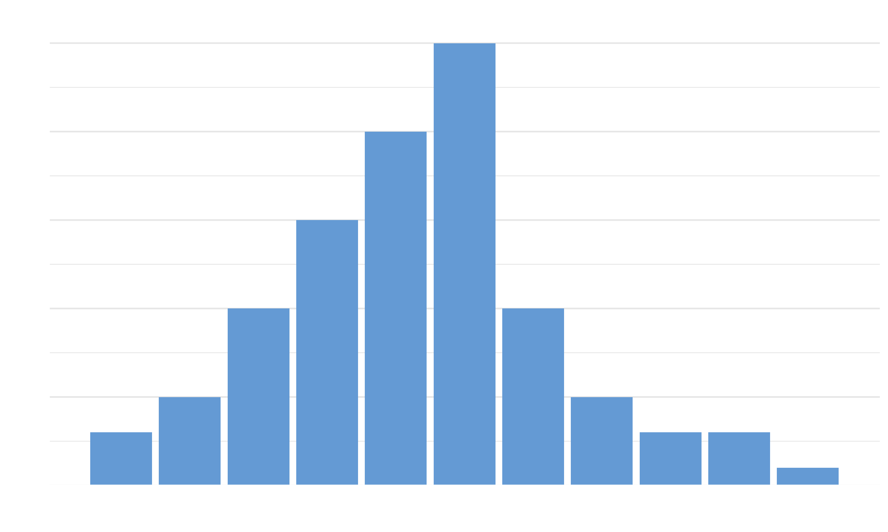
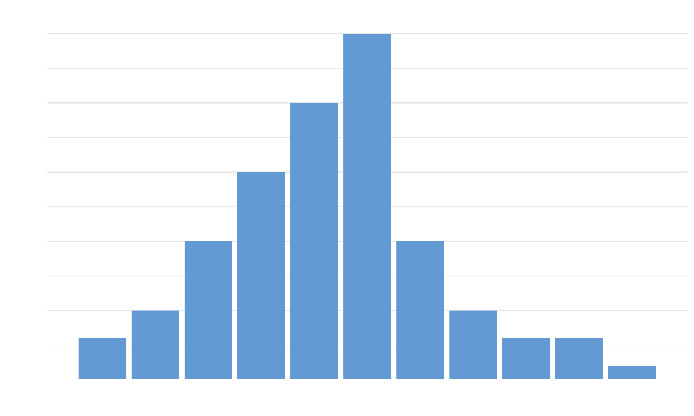
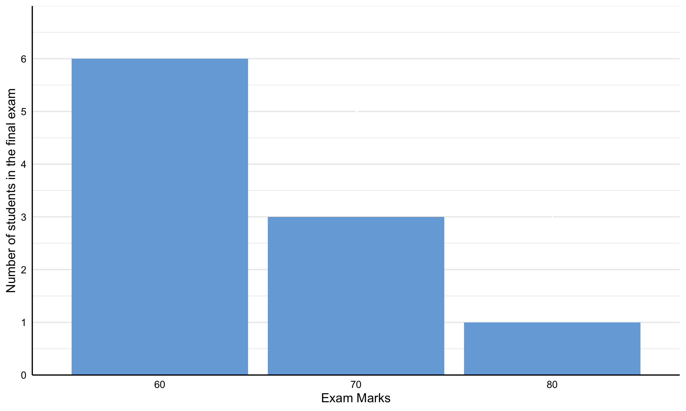
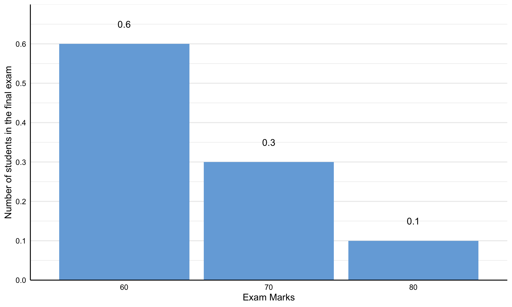

# Fundamentals

**Random Variables**

**Sample Space**

- **Sample Space**
  - **Concept**
    - A sample space of a random trial or experiment is a set of all possible outcomes of that random trial or experiment
  - **Notation**
    - The sample space is denoted by $\Omega$ (or $S$, $U$) and the set of all possible outcomes is expressed within curly brackets $\{ \}$
    - An element of the sample space is denoted by $\omega$

- **Random Variables**
  - **Concept**
    - Random variables are real-valued functions that map elements in the original sample spaces to real numbers 
    - Thus, they are functions that transform original sample spaces to real-numbered sample spaces 
    - Basically, this is when outcomes of random trials or experiments are quantified as real numbers 
  - **Notation**
    - Random variables are usually denoted by capital letters (usually the last three letters)
  - **Types of random variable**
    - **Discrete Random Variable**
      - **Concept**
        - A random variable of which there is an finite or at most countably infinite number of numerical values (i.e. the numerical output is countable) - Its numerical sample space is finite or countably infinite
    - **Continuous Random Variable**
      - **Concept**
        - A random variable of which there is an infinite number of possible numerical values (i.e. the numeric output is uncountable) - Its numerical sample space is infinite 
    

- **Distribution of random variables**
  - **Concept**
    - A distribution of a random variable is the concept of mapping each of the possible individual (point probabilities) or subset of numerical outcomes of the random variable onto its relative occurrence
    - Often times relative occurrence is normalised as probability, mostly because distributions with relative occurrence represented by probability are more analytically operationalisable 
  

- **Cumulative Distribution Function (CDF)**
  - **Concept**
    - A function that maps each of all the possible numerical outcomes of a random variable to the probability of the random variable at or below that numerical outcome 
    - The mapping can be visualised by the cumulative distribution
  - **Mathematics**
    - $F_X(x) = P(X≤x)$

- **Probability Distribution (Function) of random variables**
  - **Probability Distribution**
    - **Concept**
      - The concept of mapping each of the possible individual (point probabilities) or subset of numerical outcomes of the random variable onto its probability
    - **Types of probability distribution**
      - Cumulative 

      
  - **Probability Mass Function (pmf)**
    - **Concept**
      - A real-valued function that maps each of the possible individual numerical outcomes of a random variable to its probability
    - **Mathematics**
      - $f(x) = P(X=x)$
      

      
    - **Using the pdf to find the probability of a range of values**
      - **Concept**
        - The pdf can be used to find the probability that a random variable is in a certain range of values rather than just the probability of individual values (point probabilities)
        - The probability that a random variable is in a certain range of values is the sum of each of the point probabilities in that range 
      - **Mathematics**
        - $\displaystyle P(a ≤ X ≤ b) = \sum_{i = a}^{b}{f(x)}$
    - **Related concepts**
      - In parametric statistics, the random variable of interest is assumed to have a certain common distribution
      - In non-parametric statistics, the random variable of interest is not assumed to have a certain common distribution and the distribution (and its function) is estimated empirically (e.g. using kernal smoothing)

    

    
    

    
- **Parameters of Probability Distribution Functions**
  - **Concept**
    - Numerical measures that describe various characteristics (commonly the location, scale, and shape) of probability distributions of random variables

- **Location of a probability distribution**
  - **Concept**
    - The location of a probability distribution summarises the typical value of a random variable 
    - 
    

- Random variables
- Probability distribution and their parameters 
- Parameters using moments 
  - First moment
  - Second moment 
  - Third 
  - Fourth 

- Different types of random variables have different distributions with assumed parameters 

- 0 is the reference point on the axis 
- where is the overall weight from 
- using the 0 as a reference point to describe the point at which the mass of the distribution is acting downwards
- The first moment describes the location on the asis as distance from 0

**Expectation**

  - **Expectation of a random variable**
    - **Concept**
      - The Expectation is the population mean 
      - The expectation of a random variable $X$ is a probability-weighted sum of all of the possible numerical outcomes of the random variable $X$
      - The expectation of a random variable $X$ is the area under the function of each of all the possible numerical outcomes of the random variable $X$ weighted by its probability ($f(x) = xp(x)$)
      - This function $f(x) = xp(x)$ produces a distribution with probability-weighted value of the random variable $X$ against each of all the possible numerical outcomes of the random variable $X$. The distribution is made up of many individual columns each for each of the possible values of the random variable. The heights of the columns represent the probability-weighted values of their corresponding possible numerical outcomes of the random variable and all columns have a width of 1. This means that the area of each column simply represents the probability-weighted value of the corresponding possible numerical outcome of the random variable. The also means that the sum of the area of all the columns, which is the area of the function/distribution, is the probability-weighted sum of that random variable, which is the expectation of the random variable. Hence, the expectation of a random variable is the area of the function $f(x) = xp(x)$
      - The expectation of a random variable $X$ is the centre of mass of the probability distribution of that random variable - It is the balance point of the distribution such that the left and right side of the distribution relative to the centre point are equal in mass - Imagine a beam with a fulcrum underneath and then placing the masses $p(x_i)$ at the points $x_i$ on a beam, the position at which the fulcrum is placed on the beam for the beam to balance is the expected value 
    - **Mathematics**
      - $E(X) = \text{The area of the function} f(x) = xp(x)$)
    
- **Expectation of a discrete random variable**
  - **Concept**
    - In the discrete case, the function $f(x) = xp(x)$ produces a discrete (finite or countably infinite) distribution with the probability-weighted value of the possible numerical outcomes of the discrete random variable $X$ against the possible numeric outcomes of the discrete random variable. This distribution is like a histogram as opposed to a continuous curve like a pdf. In this finite or countably infinite distribution, the area of the function/distribution can be found through summation where the areas of all the columns are summed. Hence, the expectation is just a straightforward probability-weighted sum of all the possible numerical values of the discrete random variable $X$ 
  - **Mathematics**
    - $\displaystyle \text{E}(X) = \sum_{i  = 1}^{k}{x_i p(x_i)}$
      - ***Where***
        - $x_i$ - A particular possible numerical outcome of the random variable $X$ (e.g. the number of the success event in a binomial distribution)
        - $p(x_i)$ - The probability associated with a particular possible numerical outcome of the random variable $X$ 
        - $k$ - The total number of possible numerical outcomes of the random variable $X$

- **Expectation of a continuous random variable**
  - **Concept**
    - In the continuous case, the function $f(x) = xp(x)$ produces a continuous distribution with weighted value against the continuous random variable, which is like a pdf as opposed to a discrete distribution. The expectation is found using the same principle used in the discrete case but through another technique, integration, where the area of continuous distribution is found through the first integral of the function $f(x) = xp(x)$ to take into account all possible intermediary values of the continuous variable. 
  - **Mathematics**
    - $\displaystyle \text{E}(X) = \int_{-\infty}^{\infty}{xf(x)} ~ dx$
      - ***Where***
        - $X$ is a continuous random variable with pdf $f(x)$
        
- **Expectation of functions of random variables**
  - **Expectation of functions of discrete random variables**
    - **Mathematics**
      - $\displaystyle \text{E}(g(X)) = \sum_{i = 1}^{k}{g(x_i)p(x_i)}$
    - **Proof**
  - **Expectation of functions of continuous random variables**
    - **Mathematics**
      - $\displaystyle \text{E}(g(X)) = \int_{-\infty}^{\infty}{g(x)p(x)} ~ dx$
  - **Caveats**
    - It is worth knowing that $\text{E}(g(X)) ≠ g(\text{E}(X))$
    

- **Expectation of Linear Combinations of Random Variables**   
  - **Mathematics**
    - **Scenario**
      - Let the linear combination be 
        - $\displaystyle Y = a + \sum_{i = 1}^{n}{b_i X_i} = a + b_1X_1 + b_2X_2 + \cdots + b_nX_n$
          - ***Where***
            - $a$ is a constant
            - $b_i $ is the weight for the $ith$ random variable
            - $\text{E}(X_i)$ is the expectation of the $ith$ random variable
    - **The expectation**
      - $\displaystyle \text{E}(Y) = a + \sum_{i = 1}^{n}{b_i \text{E}(X_i)} = a + b_1\text{E}(X_1) + b_2\text{E}(X_2) + \cdots + b_n\text{E}(X_n)$
  - **Proof**
    - $\begin{aligned} \displaystyle \displaystyle Y &= a + \sum_{i = 1}^{2}{b_i X_i} = a + b_1X_1 + b_2X_2 \\ \displaystyle \text{E}(Y) &= \int_{}^{}{\int_{}^{}{~a + b_1x_1 + b_2x_2 } }~f(x_1, x_2)~dx_1dx_2 \\ \displaystyle &= a \int_{}^{}{\int_{}^{}{~f(x_1, x_2)~dx_1dx_2} } + b_1\int_{}^{}{\int_{}^{}{~x_1f(x_1, x_2)~dx_1dx_2} } + b_2 \int_{}^{}{\int_{}^{}{~x_2f(x_1, x_2)~dx_1dx_2} } \end{aligned}$
    
      
      
      
      
      
      
      
      
RUBBUSH 

  - 

**Examples**

    - **Example 1**
      - **Scenario**
        - Let $X$ be a discrete random variable of the number of cases of theft at a Sainsbury's store per day 
        - Histogram
          - 
      - **Turn the frequency to proportions**
        - 
      - **The expected value**
        - $\begin{aligned}\displaystyle \text{E}(X) &= \sum_{i  = 1}^{k}{x_i p(x_i)}\\ &=  0(\frac{3}{100}) + 1(\frac{5}{100}) + 3(\frac{10}{100})+ 3(\frac{15}{100}) +  4(\frac{20}{100}) + 5(\frac{25}{100}) + \\ &~~~~~5(\frac{10}{100}) + 7(\frac{5}{100})  + 8(\frac{3}{100}) + 9(\frac{3}{100}) + 10(\frac{1}{100}) \\ &= 0(.03) + 1(.05) + 3(.10)+ 3(.15) +  4(.20) + 5(.25) + \\ &~~~~~5(.10) + 7(.05)  + 8(.03) + 9(.03) + 10(.01) \\ &= 4.31 \end{aligned}$
    - **Example 2**
      - **Scenario**
        - There are 3 possible categories of marks for a final exam, 60, 70, and 80. Out of the cohort of 100 students, 60 achieved a mark of 60, 30 achieved 70, and 10 achieved 80. 
        - 
      - **Turn the frequency to proportions**
        - 
        - **The expectation**
        - $\begin{aligned} \displaystyle \text{E}(M) &= \sum_{i = 1}^{K}{x_i p(x_i)} \\ &= 60\left(\frac{6}{10}\right) + 70\left(\frac{3}{10}\right) + 80\left(\frac{1}{10}\right) \\  &= 60(.60) + 70(.30) + 80(.10) \\ &= 65\end{aligned}$
          - ***Notes***
            - **It is the mean version for the discrete case**
              - This is same as the mean in the discrete case where the expectation is expressed as a weighted average weighted on the proportion of each of the values instead of the sum of each of the observation over the total
            - **Mathematics**
              - $\begin{aligned} \displaystyle \text{E}(M) &= \frac{1}{N}\sum_{i = 1}^{n}{x_i} \\ &= \frac{1}{10}\left[ 60 + 60 + 60 + 60 + 60 + 60 + 70 + 70 + 70 + 80  \right] \\ &= \frac{1}{10} \left[ 60(6) + 70 (3) + 80(1)\right] \\ &= 60\left(\frac{6}{10}\right) + 70\left(\frac{3}{10}\right) + 80\left(\frac{1}{10}\right)\end{aligned}$
              - Which is just 
              - $ \displaystyle x_1p(x_1) + x_2p(x_2) + x_3p(x_3) = \sum_{i = 1}^{K}{x_i p(x_i)} $ 

      
      
      
      
      
      