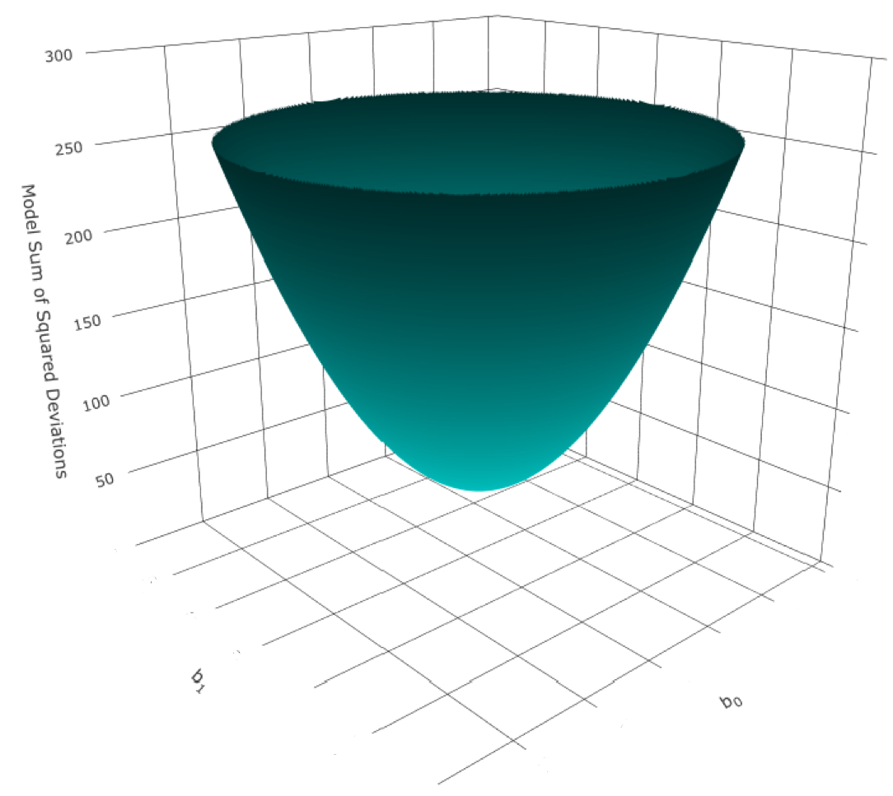
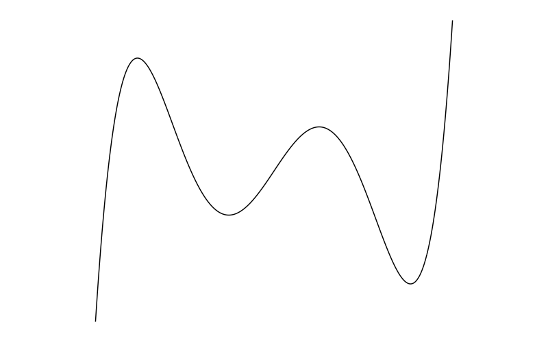

```{r setup, include=FALSE}
knitr::opts_chunk$set(echo = F)

```

```{r}
library(tidyr)
```


# The Linear Regression Model


<p style = "margin-bottom: 0px; font-size: 20px; ">**Mathematical model**</p>

- **Description**
    - A model that describes the relationship between variables with a mathematical function/expression


<p style = "margin-bottom: 0px; font-size: 20px; ">**Linear Model**</p>

- **Description**
    - A model that describes the relationship between variables with the linear function
- **Mathematics** 
    - $y = mx + c$
- **Assumption of the linear model**
    - **Linearity** - The relationship between the variables of interest is linear or best described by a linear function
    - **Additivity** - The relationship between the variables of interest is best described as a linear combination

 
<p style = "margin-bottom: 0px; font-size: 20px; ">**Regression**</p>

- **Concept**
    - The process of estimating the relationship between variables of interest


    
<p style = "margin-bottom: 0px; font-size: 20px; ">**Linear Regression**</p>

- **Concept**
  - The process of estimating the relationship between variables of interest with a linear model (fitting a straight line to the data)
  

<p style = "margin-bottom: 0px; font-size: 20px; ">**Curvilinear Regression**</p>

  - **Concept**
    - The process of estimating the relationship between variables of interest with a curvilinear model (fitting a curve to the data)


<p style = "margin-bottom: 0px; font-size: 20px; ">**Simple Linear Regression**</p>

- **Concept** 
  - Linear regression with one predictor 
- **Mathematics**
  - **Population Model**
    - $y_{i} = \beta_{0} + \beta_{1}X_{i,1} + \epsilon_{i}$
      - **Where**
          - $y_{i}$
            - The value of observation *i*
          - $\beta_{p}$
            - Regression coefficients/parameters
          - $\beta_{0}$ 
            - The intercept
            - The predicted value of the outcome when the value of predictor 1 ($X_{1}$) is 0
          - $\beta_{1}$
            - Regression coefficient/weight for predictor 1
            - Represents the magnitude and direction of the relationship between predictor 1 and the outcome as the change in the value of the outcome variable for every unit change in the value of predictor 1 (it is the gradient/slope of the regression line)
          - $X_{i,1}$ 
            - The value of predictor 1 for observation *i*
          - $\epsilon_{i}$
            - Error for observation *i*
            - Error - The absolute deviation/distance/difference between the observed value and the expected/predicted/fitted value for observation *i*
            - This quantifies the error in prediction at the observation level
  - **Sample Model**
    - $y_{i} = \hat{\beta}_{0} + \hat{\beta}_{1}x_{i,1} + e_{i}$
- **Mathematics (Matrix)**
  - **Population Model**
    - $\begin{aligned}\mathbf{Y} &= \mathbf{X}\boldsymbol{\beta} + \mathbf{E} \\ \begin{bmatrix} y_{i} \\ y_{i} \\ y_{3} \\ \vdots \\ y_{n}\end{bmatrix} &= \begin{bmatrix} 1 & x_{1} \\ 1 & x_{2} \\ 1 & x_{3} \\ \vdots & \vdots \\ 1 & x_{n}\end{bmatrix} \begin{bmatrix} \beta_{0} \\ \beta_{1} \end{bmatrix} + \begin{bmatrix} \epsilon_{1} \\ \epsilon_{2} \\ \epsilon_{3} \\ \vdots \\ \epsilon_{n}\end{bmatrix}\end{aligned}$
      - **Where**
        - $\mathbf{Y}$ 
          - A column vector that contains the values for the outcome variable for each of the observations
        - $\mathbf{X}$
          - The model matrix/design matrix
          - The model matrix contains 
            - Column vector $\mathbf{U}$
              - A column vector of 1s one for each observation. The column of 1s corresponds to $\beta_{0}$ in the $\boldsymbol{\beta}$ matrix, which means that the intercept is the same for every observation.
            - Column vector of *x* values 
              - A column vector that contains the values of predictor variable 1 for each of the observations
        - $\boldsymbol{\beta}$
          - A column vector that contains the regression coefficient/weight for each of regression parameters
        - $\mathbf{E}$
          - A column vector that contains the error of each of the observations
          
          

<p style = "margin-bottom: 0px; font-size: 20px; ">**Methods of Estimation**</p>

- Ordinary Least Squares (OLS)
- Generalised Least Squares (GLS)
- Maximum Likelihood (ML)


<p style = "margin-bottom: 0px; font-size: 20px; ">**Ordinary Least Squares**</p>

- **Concept**
  - Estimates the regression line by fitting a line that minimises the model sum of squared residuals (the sum of the squared difference/distance/deviation between each of the observed values and the corresponding predicted/fitted values)
  - $\min{\sum_{i=1}^{n}{e^{2}_{i}}} = \min{\sum_{i=1}^{n}({y_{i} - \hat\beta_{0} - \hat\beta_{1}x_{i,1}}})^2$
- **Mathematics**
  - $\hat\beta_{0} = \bar{y} - \hat\beta_{1}\bar{x}$
  - $\hat\beta_{1} = \frac{\sum_{i=1}^{n}{(x_{i,1} - \bar{x})y_{i}}}{\sum_{i=n}^{n}{(x_{i,1} - \bar{x})^2}}$
      - Note
        - I think these two equations are rather boring, looking at how they are derived is much more interesting
- **Derivation**
  - Start off with the linear model with the outcome variable as a function of the weights
    - $y_i = \hat\beta_0 + \hat\beta_{1}x_{i,1} + e_i$
  - Make the residual as the subject (express the residual as a function of the weights)
    - $e_i = y_i - \hat\beta_{0} - \hat\beta_{1}x_{i,1}$
  - Square both sides
    - $e_{i}^{2} = (y_i - \hat\beta_{0} - \hat\beta_{1}x_{i,1})^2$
  - Sum both sides 
    - $\begin{aligned}\sum_{i=1}^{n}{e_{i}^{2}} &= \sum_{i=1}^{n}{(y_i - \hat\beta_{0} - \hat\beta_{1}x_{i,1})^2} \\ S(\beta_0,\beta_1) &= \sum_{i=1}^{n}{(y_i - \hat\beta_{0} - \hat\beta_{1}x_{i,1})^2}\end{aligned}$
    - {width=30%}
  - Find the values of $\hat\beta_{0}$ and $\hat\beta_{1}$ that minimises $S(\hat\beta_{0}, \hat\beta_{1})$
    - There is a point at which the sum of squared residuals is at the minimum 
    - The $S(\hat\beta_{0}, \hat\beta_{1})$ function is a quadratic and it has a minimum that represents the minimal sum of squared residuals
    - The coordinates of the minimum are the values of $\hat\beta_{0}$ and $\hat\beta_{1}$ that give you the least sum of squared residuals (or minimises $S(\hat\beta_{0}, \hat\beta_{1})$)
    - Hence, find the values of the coordinate of the minimum of the quadratic function
    - To find each of the values of the coordinate of the minimum of the function $S(\hat\beta_{0}, \hat\beta_{1})$, the partial derivatives of the function $S(\hat\beta_{0}, \hat\beta_{1})$ with respect to each of the $\hat\beta$s are set to 0 (because the minimum has a slope of 0)
    - Expression for $\hat\beta_0$
      - $\frac{\partial{S}}{\partial{\hat\beta_{0}}}=-2\sum_{i=1}^{n}{(y_i - \hat\beta_{0} - \hat\beta_{1}x_{i,1})}$
    - Expression for $\hat\beta_1$
      - $\frac{\partial{S}}{\partial{\hat\beta_{1}}}=-2\sum_{i=1}^{n}{x_{i,1}(y_i - \hat\beta_{0} - \hat\beta_{1}x_{i,1})}$
    - Solve the above simultaneous equations
    - Solving the above simultaneous equations would result in 
      - $\hat\beta_{0} = \frac{\sum_{i=1}^{n}{x_{i,1}}\sum_{i=1}^{n}{y_{i}} - \sum_{i=1}^{n}{x_{i,1}}\sum_{i=1}^{n}{x_{i,1}y_{i}}}{n\sum_{i=1}^{n}{x_{i,1}^2}-(\sum_{i=1}^{n}{x_{i,1}})^2}$
      - $\hat\beta_{1} = \frac{n\sum_{i=1}^{n}{x_{i,1}y_i} - \sum_{i=1}^{n}{x_{i,1}}\sum_{i=1}^{n}{y_{i}}}{n\sum_{i=1}^{n}{x_{i,1}^2}-(\sum_{i=1}^{n}{x_{i,1}})^2}$
    - Solving the simultaneous equations would also result in 
      - For $\hat\beta_{0}$
        - $\hat\beta_{0} = \bar{y} - \hat\beta_{1}\bar{x}$
      - For $\hat\beta_{1}$
        - $\hat\beta_{1} = \frac{\sum_{i=1}^{n}{(x_{i,1} - \bar{x})(y_{i} - \bar{y})}}{\sum_{i=n}^{n}{(x_{i,1} - \bar{x})^2}}$
        - $\hat\beta_{1} = \frac{\sum_{i=1}^{n}{(x_{i,1} - \bar{x})y_{i}}}{\sum_{i=n}^{n}{(x_{i,1} - \bar{x})^2}}$
        - $\hat\beta_{1} = \frac{Cov(x,y)}{s_{x}^{2}}$
        - $\hat\beta_{1} = \frac{S_{xx}}{S_{xx}}$
- **Mathematics (Matrix)**
  - $\boldsymbol{\beta} = (\mathbf{X'X)^{-1}X'Y}$
- **Derivation (Matrix)**
  - $S(\boldsymbol{\hat\beta}) = ||\mathbf{u}||^2 = ||\mathbf{Y-\hat{Y}}||^2 = ||\mathbf{Y-X\boldsymbol{\beta}}||^2$
  - *note* - Matrix derivation not complete


<p style = "margin-bottom: 0px; font-size: 20px; ">**Variance of $\beta$**</p>

- Variance of $\beta$
  - **Variance of $\beta_{0}$**
    - **Mathematics** 
      - $\text{Var}(\hat\beta_{0}) = \sigma_{\hat\beta_{0}}^{2} = \frac{\sigma^{2}\sum_{i=1}^{n}{x_{i,1}^2}}{n\sum_{i=1}^{n}{x^{2}_{i,1}}-(\sum_{i=1}^{n}{x_{i,1}})^2}$
      - $\text{SE}_{\hat\beta_{0}} = \sigma_{\hat\beta_{0}} = \sqrt{\frac{\sigma^{2}\sum_{i=1}^{n}{x_{i,1}^2}}{n\sum_{i=1}^{n}{x^{2}_{i,1}}-(\sum_{i=1}^{n}{x_{i,1}})^2}}$
    - **Estimation from the sample**
      - **Description**
        - $\sigma^{2}$ is unknown
        - Since $\sigma^{2}$ is the variance of the population model (the average model sum of squared errors), it is reasonable to use the variance of the sample model ($s^2$) as the estimator 
        - It has been shown that $s^2$ is an unbiased estimator of $\sigma^{2}$
      - **Mathematics**
        - $\hat{\text{Var}(\hat\beta_{0})} = \hat\sigma_{\hat\beta_{0}}^{2} = \frac{s^{2}\sum_{i=1}^{n}{x_{i,1}^2}}{n\sum_{i=1}^{n}{x^{2}_{i,1}}-(\sum_{i=1}^{n}{x_{i,1}})^2}$
        - $\hat{\text{SE}}_{\hat\beta_{0}} = \hat\sigma_{\hat\beta_{0}} = \sqrt{\frac{s^{2}\sum_{i=1}^{n}{x_{i,1}^2}}{n\sum_{i=1}^{n}{x^{2}_{i,1}}-(\sum_{i=1}^{n}{x_{i,1}})^2}}$
  - **Variance of $\beta_{1}$**
    - **Population**
      - **Mathematics** 
        - $\sigma_{\hat\beta_{1}^{2}} = \frac{n\sigma^{2}}{n\sum_{i=1}^{n}{x^{2}_{i,1}}- (\sum_{i=1}^{n}{x_{i,1}})^2}$
        - $\text{Var}(\hat\beta_{1}) = \sigma_{\hat\beta_{1}^{2}} = \frac{n\sigma^{2}}{n\sum_{i=1}^{n}{(x_{i,1} - \bar{x})^2}}$
        - $\text{Var}(\hat\beta_{1}) = \sigma_{\hat\beta_{1}}^{2} = \frac{\sigma^{2}}{\sum_{i=1}^{n}{(x_{i,1} - \bar{x})^2}}$
        - $\text{SE}_{\hat\beta_{1}} = \sigma_{\hat\beta_{1}} = \sqrt{\frac{\sigma^{2}}{\sum_{i=1}^{n}{(x_{i,1} - \bar{x})^2}}}$
    - **Estimation from the sample**
      - **Mathematics**
        - $\hat{\text{Var}(\hat\beta_{1})} = \hat\sigma_{\hat\beta_{1}}^{2} = \frac{s^{2}}{\sum_{i=1}^{n}{(x_{i,1} - \bar{x})^2}}$
        - $\hat{\text{SE}}_{\hat\beta_{1}} = \hat\sigma_{\hat\beta_{1}} = \sqrt{\frac{s^{2}}{\sum_{i=1}^{n}{(x_{i,1} - \bar{x})^2}}}$


<p style = "margin-bottom: 0px; font-size: 20px; ">**Assumptions of the Linear Models**</p>

- Linearity 
- Additivity
- Normality of the sampling distribution
- Uncorrelated errors
- Heteroscedasticity

<p style = "margin-bottom: 0px; font-size: 20px; ">**Linearity**</p>

- **Concept**
  - The relationship between each of the predictor variables and the outcome is linear (or best described as linear)
  - This is the most important assumption of linear models because even if all other assumptions are met, the model is invalid because the description of the process you want to model is wrong 
- **Treatment**
  - Transformation
  - Segmented regression
  - Fit non-linear models 
  
 <p style = "margin-bottom: 0px; font-size: 20px; ">**Additivity**</p>

- **Concept**
  - The combined effect of multiple predictors in a multiple regression is best described as a linear combination of the predictors
  - This, along with linearity, is the most important assumptions of linear models 
- **Treatment**
  - Transformation
  - Segmented regression
  - Fit non-linear models 
   

<p style = "margin-bottom: 0px; font-size: 20px; ">**Uncorrelated Errors**</p>

- **Concept**
  - The errors in the population model are uncorrelated with each other
  - In other words, there is no autocorrelation/serial correlation 
  - The distribution of errors at given value of x is uncorrelated with the distribution of errors at another value of x
  - It is important to note that the errors are not individual errors, they are theoretical distribution of errors given x, in other words, for each vale of x, there is a distribution of errors, and the observed residuals given x you have are sampled from the distribution of errors given the same x (see [this short description on CrossValidated]( https://stats.stackexchange.com/questions/103439/how-to-calculate-the-covariance-between-two-observations-of-the-same-variable))
- **Mathematics**
  - $\text{Cov}(e_{i}, e_{j}) = 0$
- **Mathematics**
  - $\boldsymbol\Phi = \Sigma_{e_{i}e_{j}} = \sigma^{2}\mathbf{I} = \begin{bmatrix} \sigma_{1,1}^{2} & 0 & 0 & \cdots & 0 \\ 0 & \sigma_{2,2}^{2} & 0 & \cdots & 0 \\ 0 & 0 & \sigma_{3,3}^{2} & \cdots & 0 \\ \vdots & \vdots & \vdots & \ddots & \vdots \\ 0 & 0 & 0 & 0 & \sigma_{i,j}^{2} \end{bmatrix}$
    - ***Note***
      - All the off-diagonals are 0s, indicating that all errors are uncorrelated with each other 
      - The variances are unconstrained, hence, they can vary 
- **Effects of correlated errors on OLS estimation**
    - **Biased SE**
      - The standard mathematical expression of the estimate of the variance of the sampling distribution ($\frac{\sigma^{2}}{\sum_{i=1}^{n}{(x_{i,1} - \bar{x})^2}}$) is a biased estimate of the true variance of the sampling distribution 
        - If errors are positively correlated, the standard mathematical expression of the estimate of the variance of the sampling distribution ($\frac{\sigma^{2}}{\sum_{i=1}^{n}{(x_{i,1} - \bar{x})^2}}$) will underestimate the true value (a negative bias), this means that the true sampling variance and SE are larger than estimated, this means that OLS is less efficient/optimal than other estimators, this follows that all statisticl inferences involving the SE will be biased (e.g. underestimating the confidence intervals, overestimating the p-value in significance tests, higher Type I error etc.)
- **Assessing Autocorrelation**
  - See the autcorrelation section 
- **Treatment**
  - Autocorrelation consistent standard errors 
  - Cluster robust standard errors 
  - Use other estimators 
 
  


<p style = "margin-bottom: 0px; font-size: 20px; ">**Normality of the Sampling Distribution**</p>

- **Concept**
  - The sampling distribution of the sample estimates is normally distributed 
  - A normally distributed sampling distribution is desirable because it can be modelled easily with the normal distribution curve and inferential statistics can be easily derived (which may be easier than if it has a non-normal distribution, e.g. Pearson's r)
- **Effects of violation of the assumption**
  - All the standard mathematical expressions and procedures for estimating the inferential statistics and uncertainty of the sample estimate are based on the assumption that the sampling distribution is normal or at least approximately normal. If the true sampling distribution is not normal, then all the inferential statistics and estimates of uncertainty of the sample estimate are incorrect
- **Assessing Normality of the sampling distribution**
  - Distribution of model residuals 
    - **Description**
      - Assess whether the model residuals are normally distributed
    - **Explanation**
      - In general, in a linear combination of variables, if the variables in the linear combination are random, independent, and normally distributed (their sampling distribution), then the linear combination itself is also normally distributed (the sampling distribution of the linear combination is normal)
      - Each of the regression parameters can be expressed as a linear combination 
        - $\hat\beta_{1} = \frac{\sum_{i=1}^{n}{(x_i - \bar{x} )y_i}}{\sum_{i=1}^{n}{(x_i - \bar{x})^2}} = \sum_{i=1}^{n}{\frac{x_i - \bar{x}}{\sum_{i=1}^{n}{(x_i - \bar{x})^2}}y_i}$
          - ***Where***
            - $\frac{x_i - \bar{x}}{\sum_{i=1}^{n}{(x_i - \bar{x})^2}}$ is treated as a constant and $y_i$ is treated a variable
      - Hence, for the linear combination ($\hat\beta_1$) to be normally distributed, the random variable $y_i$ has to be independent and normally distributed
      - Since independence and normality of the errors imply independence and normality of the random variable $y_i$, normality of errors can be used to indicate that the linear combination ($\hat\beta_1$) is normally distributed
      - And since we don't have the errors in hand, we use the model residuals 
    - **Assessing normality**
      - See the 'Assessing Normality' section
- **The Central Limit Theorem and the assumption of normality**
  - The distribution of the residuals is not important if sample size is "sufficiently" large according to the Central Limit Theorem. (The CLT states that the sampling distribution is approximately normal if sample size is large and can be assumed to be normal if sample size is sufficiently large (n > 30) regardless of the shape of the population distribution)
  - Hence, there is much less to worry about the non-normality of the sampling distribution if the sample size is "sufficiently" large
- **Just some side notes**
  - $y_i$ also needs to be normally distributed, if y is not normally distributed, then the scores of y need to be transformed such that it's sampling distribution is normal or approximately normal (I am still not sure about this part)


<p style = "margin-bottom: 0px; font-size: 20px; ">**Autocorrelation**</p>

- **Description**
  - Aka serial correlation
  - Errors given x are correlated with errors in other values of x
  - Autocorrelation is often described with respect to time because autocorrelation usually occurs in time series data (correlated across time)
- **Reasons for autocorrelation**
  - **Temporal autocorrelation**
    - **Description**
      - Autocorrelation across time time 
    - **Examples**
      - Repeated measures designs
      - Time series 
      - Longitudinal designs 
      - Growth models 
  - **Spatial autocorrelation**
    - **Description** 
      - Autocorrelation due to space 
    - **Examples** 
      - Clustered data 
  - **Ignoring covariates**
    - If a covariate is not included in the model, the errors will capture the effect of that covariate
    - The error is not random - There are systematic process in the errors that are mistreated as random or ignored
  - **Model misspecification** 
    - E.g. ignoring linearity 
  - **Measurement error in the independent variable**
- **Types of serial correlation**
  - First-order serial correlation
- **First-order serial correlation**
  - **Description**
    - The correlation between errors at any one point of x ($e_{x}$) and errors at the point of x that is 1 unit less ($e_{x-1}$)
    - Note that t is often used instead of x, but I am keeping things general here
  - **Visualisation**
    - **Positive first-order serial correlation**
      - 
    - **Negative first-order serial correlation**
      - 
  - **Mathematical concept**
    - Tests testing for first-order serial correlation usually assess whether errors given $x$ can be predicted by errors a unit of x that is 1 unit smaller ($x - 1$)
  - **Mathematics**
    - $e_{t} = \rho{}e_{x-1} + u_x$
      - ***Where***
        - $\rho{}$ - First-order serial correlation coefficient 
        - The process for the error term is called the first-order autoregressive process (AR1)
  - **Tests for first-order serial correlation** 
    - Durbin-Watson test
    - Breusch-Godfrey test
  - **Durbin-Watson test**
    - **The Durbin-Watson statistic**
      - **Mathematics**
        - $d = \frac{\sum_{t=2}^{n}{(e_{t} - e_{t-1})^2}}{\sum_{t=1}^{n}{e_{t}^{2}}}$
      - **Interpretation**
        - $0 ≤ d ≤ 4$
        - $d = 2$ - No serial correlation
        - $d < 2$ - Positive serial correlation ($d < 1$ is interpreted as serious positive serial correlation and thus concerning)
        - $d > 2$ - Negative serial correlation
    - **Significance testing**
      - Statistical significance of the Durbin-Watson statistic us often sort through assessing whether the observed Durbin-Watson statistic is inside or outside the critical boundary in the sampling distribution under the null hypothesis
      - The critical boundary is a function of sample size and the number of variables
  - **Breusch-Godfrey test (Breusch & Godfrey, 1978)**
    - **Concept**
      - Aka auxiliary regression (A regression for supplementary purposes)
      - Tests the extent to which the errors given x can be predicted by the predictor in the model and the model error at a value of x that is 1 less, model error at a value of x that is 2 less, model error at a value of x that is 3 less, and so on (these are the lagged variables, and the number of lagged variables is defined by the researcher, but some people may include lagged variables until the errors in that auxiliary regression is no longer autocorrelated)
    - **Mathematics**
      - $e_{t} = \beta_{0} + \beta_{1}x_i + \beta_{2}e_{t-1} + \beta_{3}e_{t-2} + \beta_{4}e_{t-3} + \cdots + \beta_{p+1}e_{t-p} + u_i$
    - **Null Hypothesis Significance Test**
      - **The Breusch-Godfrey test statistic**
        - **Mathematics (wiki)** 
          - $nR^2$
      - **Distribution of the Breusch-Godfrey test statistic**
        - $nR^2 \sim{} \chi_{p}^{2}$
          - **Warning**
            - A source (zed statistics) said it is $(n-p)R^2 \sim{} \chi_{p}^{2}$
            - But they are very similar, so I think it's fine
      - **Hypotheses**
        - $H_0:$ There is no autocorrelation
        - $H_1:$ There is autocorrelation in the lagged variables in the model
      

      
```{r qqplot1, include = F, echo = F}
library(tidyverse)

qqplot1 <- ggplot2::ggplot(data = iris, aes(sample = Sepal.Length)) + 
  qqplotr::stat_qq_point(size = 1, alpha = 0.6) + 
  qqplotr::stat_qq_line(colour = "#008898") + 
  qqplotr::stat_qq_band(fill = "#008898", alpha = 0.3) + 
  labs(
    x = "Theoretical Quantile", 
    y = "Observed Quantile") +
  theme_minimal()

png(file = "image/qqplot1.png", res = 100, width = 800, height = 500)
qqplot1
dev.off()


```


<p style = "margin-bottom: 0px; font-size: 20px; ">**Assessing Normality**</p>

- **Ways to assess normality**
  - Plots
  - Statistical Tests


- **Plots**
  - **Types of plots** 
    - Frequency Distribution plot (e.g. histogram)
    - Theoretical vs Observed distribution plots
  - **Theoretical vs Observed Distribution plots** 
    - **Description**
      - A plot with the distributional points of a particular distribution of interest and the distributional points of the data 
      - It visualises how well the distributional point of each of the data points fit their corresponding distributional point a particular distribution of interest (e.g. a normal distribution)
      - The corresponding distributional point is the expected value that the observed score should have in a particular distribution of interest 
    - **Types** 
      - P-P plot
      - Q-Q plot
    - **P-P plot**
      - **Description**
        - A plot with the probability of each of the points of a particular distribution of interest against the probability of each of the data points in the data (relative to the whole data)
      - **P-P plot for the normal distribution**
        - **Concept**
          - A plot with the probability of each of the points of a normal distribution against the probability of each of the data points in the data (relative to the whole data)
    - **Q-Q plot**
      - **Description**
        - A plot with the quantile or z-score of each of the points of a particular distribution of interest against the quantile or z-score of each of the data points in the data (relative to the whole data)
        - <a href="https://samuel-mak.github.io/statistics/06-r_codes.html#r_codes_normality">
         </a>
     
      - **Q-Q plot for the normal distribution**
        - **Concept**
          - A plot with the quantile or z-score of each of the points of a normal distribution against the quantile or z-score of each of the data points in the data (relative to the whole data)
        - **Visualisation**
          - {width=30%}


[](https://samuel-mak.github.io/statistics/r-codes.html#normality)


https://samuel-mak.github.io/statistics/r-codes.html#normality


